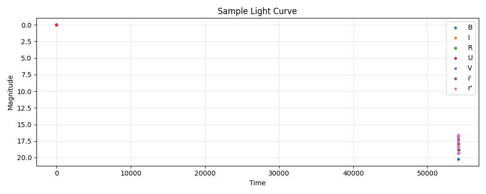

---
configs:
- config_name: default
  data_dir: mmu_cfa_cfa3/dataset
tags:
- astronomy
license: cc-by-4.0
pretty_name: mmu_cfa_cfa3
size_categories:
- n<1K
---

<div align="center">

</div>

# mmu_cfa_cfa3 HATS Catalog Collection

This is the collection of HATS catalogs representing mmu_cfa_cfa3.

This dataset is part of the [Multimodal Universe](https://github.com/MultimodalUniverse/MultimodalUniverse),
a large-scale collection of multimodal astronomical data. For full details, see the paper:
[The Multimodal Universe: Enabling Large-Scale Machine Learning with 100TBs of Astronomical Scientific Data](https://arxiv.org/abs/2412.02527).

### Access the catalog

We recommend the use of the [LSDB](https://lsdb.io) Python framework to access HATS catalogs.
LSDB can be installed via `pip install lsdb` or `conda install conda-forge::lsdb`,
see more details [in the docs](https://docs.lsdb.io/).
The following code provides a minimal example of opening this catalog:

```python
import lsdb

# Full sky coverage.
catalog = lsdb.open_catalog("https://huggingface.co/datasets/UniverseTBD/mmu_cfa_cfa3")
# One-degree cone.
catalog = lsdb.open_catalog(
    "https://huggingface.co/datasets/UniverseTBD/mmu_cfa_cfa3",
    search_filter=lsdb.ConeSearch(ra=12.0, dec=36.0, radius_arcsec=3600.0),
)
```

Each catalog in this collection is represented as a separate [Apache Parquet dataset](https://arrow.apache.org/docs/python/dataset.html) and can be accessed with a variety of tools, including `pandas`, `pyarrow`, `dask`, `Spark`, `DuckDB`.

### File structure

This catalog is represented by the following files and directories:

- [`collection.properties`](https://huggingface.co/datasets/UniverseTBD/mmu_cfa_cfa3/collection.properties) � textual metadata file describing the HATS collection of catalogs
- [`mmu_cfa_cfa3`](https://huggingface.co/datasets/UniverseTBD/mmu_cfa_cfa3/mmu_cfa_cfa3) � main HATS catalog directory
  - [`dataset/`](https://huggingface.co/datasets/UniverseTBD/mmu_cfa_cfa3/mmu_cfa_cfa3/dataset/) � Apache Parquet dataset directory for the main catalog
    - ... parquet metadata and data files in sub directories ...
  - [`hats.properties`](https://huggingface.co/datasets/UniverseTBD/mmu_cfa_cfa3/mmu_cfa_cfa3/hats.properties) � textual metadata file describing the main HATS catalog
  - [`partition_info.csv`](https://huggingface.co/datasets/UniverseTBD/mmu_cfa_cfa3/mmu_cfa_cfa3/partition_info.csv) � CSV file with a list of catalog HEALPix tiles (catalog partitions)
  - [`skymap.fits`](https://huggingface.co/datasets/UniverseTBD/mmu_cfa_cfa3/mmu_cfa_cfa3/skymap.fits) � HEALPix skymap FITS file with row-counts per HEALPix tile of fixed order 10
- [`mmu_cfa_cfa3_10arcs/`](https://huggingface.co/datasets/UniverseTBD/mmu_cfa_cfa3/mmu_cfa_cfa3_10arcs) � default margin catalog to ensure data completeness in cross-matching, the margin threshold is 10.0 arcseconds
  - ... margin catalog files and directories ...

### Catalog metadata

Metadata of the main HATS catalog, excluding margins and indexes:

| **Number of rows** | **Number of columns** | **Number of partitions** | **Size on disk** | **HATS Builder** |
| --- | --- | --- | --- | --- |
| 185 | 5 | 170 | 192.9 MiB | hats-import v0.7.3, hats v0.7.3 |


### Catalog columns

The main HATS catalog contains the following columns:

| **Name** |  **`_healpix_29`** | **`lightcurve.band`** | **`lightcurve.time`** | **`lightcurve.mag`** | **`lightcurve.mag_err`** | **`ra`** | **`dec`** | **`obj_type`** | **`object_id`** |
| --- |  --- | --- | --- | --- | --- | --- | --- | --- | --- |
| **Data Type** |  int64 | list[string] | list[float] | list[float] | list[float] | double | double | string | string |
| **Nested?** |  � | lightcurve | lightcurve | lightcurve | lightcurve | � | � | � | � |
| **Value count** |  185 | 21,105 | 21,105 | 21,105 | 21,105 | 185 | 185 | 185 | 185 |
| **Example row** |  183542961553446571 | [B, B, B, B, B, B, B, B, B, B, B, B, � (84 total)] | [5.405e+04, 5.405e+04, 5.406e+04, � (84 total)] | [17.76, 17.83, 18.15, 18.31, 19.47, � (84 total)] | [0.02, 0.018, 0.02, 0.022, 0.047, � (84 total)] | 11.66 | 36.33 | SN Ia | SN2006mo |
| **Minimum value** |  15796931177724156 | B | -0.0 | -0.0 | -0.0 | -0.0 | -27.562610626220703 | ? | SN2001C |
| **Maximum value** |  3169126945126157037 | r' | 54596.1875 | 22.381000518798828 | 0.8669999837875366 | 359.6354064941406 | 79.03182983398438 | SN Ia-pec | SN2008bf |


"Nested" indicates whether the column is stored as a nested field inside another "struct" column.


"Value count" may be different from the total number of rows for nested columns: each nested element is counted as a single value.


### Crossmatch with another catalog

HATS catalogs can be efficiently crossmatched using [LSDB](https://lsdb.io),
which leverages the HEALPix partitioning to avoid loading the full datasets into memory:

```python
import lsdb

mmu_cfa_cfa3 = lsdb.open_catalog("https://huggingface.co/datasets/UniverseTBD/mmu_cfa_cfa3")
other = lsdb.open_catalog("https://huggingface.co/datasets/<org>/<other_catalog>")

crossmatched = mmu_cfa_cfa3.crossmatch(other, radius_arcsec=1.0)
print(crossmatched)
```

See the [LSDB documentation](https://docs.lsdb.io/) for more details on crossmatching and other operations.

### Dataset-specific context

**Original survey**  
This dataset is based on the Harvard-Smithsonian Center for Astrophysics (CfA) Supernova Group observations and contains light curves of Type Ia supernovae observed between 2000 and 2011.

**Data modality**  
The dataset consists of light curve data for 185 Type Ia supernovae in the UBVRIr’i’ bands. Each sample includes sky coordinates (ra, dec), object identifiers and classification, and a light curve with time (modified Julian date), band, magnitude (mag), and magnitude error (mag_err).

**Typical use cases**  
Type Ia supernovae from this dataset have been widely used in cosmological analyses and are included in major compilations such as Pantheon, Pantheon+, and other supernova samples.

**Caveats**  
The dataset is part of a curated compilation and follows the structure defined by the CfA Supernova Group. The flux and flux_err fields are replaced by mag and mag_err fields, which present the original photometric measurements in the standard photometric system.

**Citation**  
Data are obtained from the [CfA Supernova Archive](https://lweb.cfa.harvard.edu/supernova/). Users should cite the corresponding CfA3 publication and acknowledge the CfA Supernova Archive.
