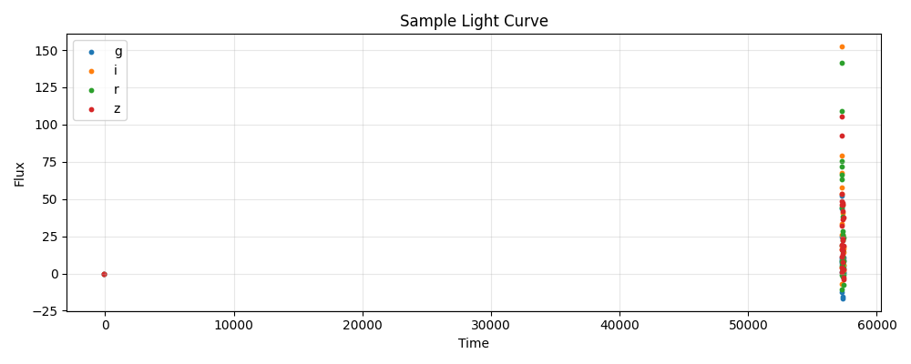

<div align="center">

</div>

---
configs:
- config_name: default
  data_dir: mmu_des_y3_sne_ia/dataset
tags:
- astronomy
license: cc-by-4.0
pretty_name: mmu_des_y3_sne_ia
size_categories:
- n<1K
---

# mmu_des_y3_sne_ia HATS Catalog Collection

This is the collection of HATS catalogs representing mmu_des_y3_sne_ia.

This dataset is part of the [Multimodal Universe](https://github.com/MultimodalUniverse/MultimodalUniverse),
a large-scale collection of multimodal astronomical data. For full details, see the paper:
[The Multimodal Universe: Enabling Large-Scale Machine Learning with 100TBs of Astronomical Scientific Data](https://arxiv.org/abs/2412.02527).

### Access the catalog

We recommend the use of the [LSDB](https://lsdb.io) Python framework to access HATS catalogs.
LSDB can be installed via `pip install lsdb` or `conda install conda-forge::lsdb`,
see more details [in the docs](https://docs.lsdb.io/).
The following code provides a minimal example of opening this catalog:

```python
import lsdb

# Full sky coverage.
catalog = lsdb.open_catalog("https://huggingface.co/datasets/UniverseTBD/mmu_des_y3_sne_ia")
# One-degree cone.
catalog = lsdb.open_catalog(
    "https://huggingface.co/datasets/UniverseTBD/mmu_des_y3_sne_ia",
    search_filter=lsdb.ConeSearch(ra=35.0, dec=-6.0, radius_arcsec=3600.0),
)
```

Each catalog in this collection is represented as a separate [Apache Parquet dataset](https://arrow.apache.org/docs/python/dataset.html) and can be accessed with a variety of tools, including `pandas`, `pyarrow`, `dask`, `Spark`, `DuckDB`.

### File structure

This catalog is represented by the following files and directories:

- [`collection.properties`](https://huggingface.co/datasets/UniverseTBD/mmu_des_y3_sne_ia/collection.properties) � textual metadata file describing the HATS collection of catalogs
- [`mmu_des_y3_sne_ia`](https://huggingface.co/datasets/UniverseTBD/mmu_des_y3_sne_ia/mmu_des_y3_sne_ia) � main HATS catalog directory
  - [`dataset/`](https://huggingface.co/datasets/UniverseTBD/mmu_des_y3_sne_ia/mmu_des_y3_sne_ia/dataset/) � Apache Parquet dataset directory for the main catalog
    - ... parquet metadata and data files in sub directories ...
  - [`hats.properties`](https://huggingface.co/datasets/UniverseTBD/mmu_des_y3_sne_ia/mmu_des_y3_sne_ia/hats.properties) � textual metadata file describing the main HATS catalog
  - [`partition_info.csv`](https://huggingface.co/datasets/UniverseTBD/mmu_des_y3_sne_ia/mmu_des_y3_sne_ia/partition_info.csv) � CSV file with a list of catalog HEALPix tiles (catalog partitions)
  - [`skymap.fits`](https://huggingface.co/datasets/UniverseTBD/mmu_des_y3_sne_ia/mmu_des_y3_sne_ia/skymap.fits) � HEALPix skymap FITS file with row-counts per HEALPix tile of fixed order 10
- [`mmu_des_y3_sne_ia_10arcs/`](https://huggingface.co/datasets/UniverseTBD/mmu_des_y3_sne_ia/mmu_des_y3_sne_ia_10arcs) � default margin catalog to ensure data completeness in cross-matching, the margin threshold is 10.0 arcseconds
  - ... margin catalog files and directories ...

### Catalog metadata

Metadata of the main HATS catalog, excluding margins and indexes:

| **Number of rows** | **Number of columns** | **Number of partitions** | **Size on disk** | **HATS Builder** |
| --- | --- | --- | --- | --- |
| 496 | 7 | 11 | 192.3 MiB | hats-import v0.7.3, hats v0.7.3 |


### Catalog columns

The main HATS catalog contains the following columns:

| **Name** |  **`_healpix_29`** | **`lightcurve.band`** | **`lightcurve.time`** | **`lightcurve.flux`** | **`lightcurve.flux_err`** | **`redshift`** | **`host_log_mass`** | **`ra`** | **`dec`** | **`obj_type`** | **`object_id`** |
| --- |  --- | --- | --- | --- | --- | --- | --- | --- | --- | --- | --- |
| **Data Type** |  int64 | list[string] | list[float] | list[float] | list[float] | float | float | double | double | string | string |
| **Nested?** |  � | lightcurve | lightcurve | lightcurve | lightcurve | � | � | � | � | � | � |
| **Value count** |  496 | 46,344 | 46,344 | 46,344 | 46,344 | 496 | 496 | 496 | 496 | 496 | 496 |
| **Example row** |  1243942473816715777 | [g, g, g, g, g, g, g, g, g, g, g, � (112 total)] | [5.694e+04, 5.695e+04, 5.696e+04, � (112 total)] | [1.838, 3.156, -1.974, -0.876, � (112 total)] | [4.258, 6.417, 3.601, 4.023, 5.391, � (112 total)] | 0.2883 | 10.38 | 34.83 | -5.789 | Ia | DES_1313594 |
| **Minimum value** |  1243402345506524657 | g | -99.0 | -465.260009765625 | -0.0 | 0.05962910130620003 | 2.0 | 6.669886112213135 | -44.91709899902344 | Ia | DES_1248677 |
| **Maximum value** |  2542315152193303737 | z | 57428.0546875 | 4431.10205078125 | 134.26699829101562 | 0.8485189080238342 | 11.562000274658203 | 55.340694427490234 | 0.9379519820213318 | Ia | DES_1347120 |


"Nested" indicates whether the column is stored as a nested field inside another "struct" column.


"Value count" may be different from the total number of rows for nested columns: each nested element is counted as a single value.


### Crossmatch with another catalog

HATS catalogs can be efficiently crossmatched using [LSDB](https://lsdb.io),
which leverages the HEALPix partitioning to avoid loading the full datasets into memory:

```python
import lsdb

mmu_des_y3_sne_ia = lsdb.open_catalog("https://huggingface.co/datasets/UniverseTBD/mmu_des_y3_sne_ia")
other = lsdb.open_catalog("https://huggingface.co/datasets/<org>/<other_catalog>")

crossmatched = mmu_des_y3_sne_ia.crossmatch(other, radius_arcsec=1.0)
print(crossmatched)
```

See the [LSDB documentation](https://docs.lsdb.io/) for more details on crossmatching and other operations.

### Dataset-specific context

**Original survey**  
This dataset is based on observations from the [Dark Energy Survey (DES)](https://www.darkenergysurvey.org/), specifically the Year 3 supernova sample, and compiled as part of the [Pantheon+ compilation](https://iopscience.iop.org/article/10.3847/1538-4357/ac8b7a/pdf). It contains spectroscopically confirmed Type Ia supernovae used for cosmological studies.

**Data modality**  
The dataset consists of light curves, i.e. time-series data including observation time, flux, flux error, and bandpass filter (griz). It also includes metadata such as redshift, coordinates, host galaxy mass, and supernova classification.

**Typical use cases**  
It is commonly used for photometric redshift prediction, light curve modeling, and inpainting tasks.

**Caveats**  
The dataset includes only spectroscopically confirmed Type Ia supernovae and is subject to selection cuts from the Pantheon+ compilation.

**Citation**  
Users should cite the Dark Energy Survey (DES) and the associated Pantheon+ and DES supernova papers. The dataset is released under the CC BY 4.0 license, requiring attribution to the original authors.
