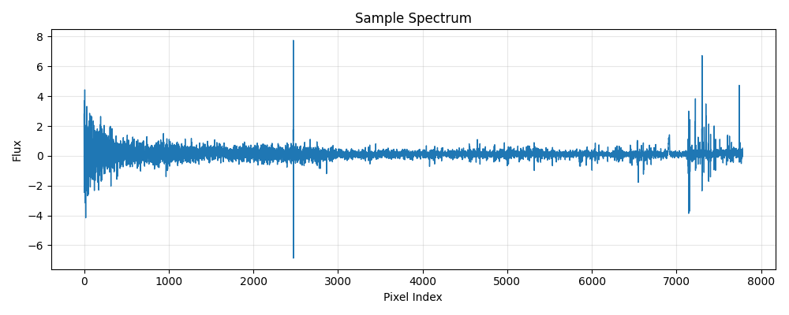

<div align="center">

</div>

---
configs:
- config_name: default
  data_dir: mmu_desi_edr_sv3/dataset
tags:
- astronomy
license: cc-by-4.0
pretty_name: mmu_desi_edr_sv3
size_categories:
- 1M<n<10M
---

# mmu_desi_edr_sv3 HATS Catalog Collection

This is the collection of HATS catalogs representing mmu_desi_edr_sv3.

This dataset is part of the [Multimodal Universe](https://github.com/MultimodalUniverse/MultimodalUniverse),
a large-scale collection of multimodal astronomical data. For full details, see the paper:
[The Multimodal Universe: Enabling Large-Scale Machine Learning with 100TBs of Astronomical Scientific Data](https://arxiv.org/abs/2412.02527).

### Access the catalog

We recommend the use of the [LSDB](https://lsdb.io) Python framework to access HATS catalogs.
LSDB can be installed via `pip install lsdb` or `conda install conda-forge::lsdb`,
see more details [in the docs](https://docs.lsdb.io/).
The following code provides a minimal example of opening this catalog:

```python
import lsdb

# Full sky coverage.
catalog = lsdb.open_catalog("https://huggingface.co/datasets/UniverseTBD/mmu_desi_edr_sv3")
# One-degree cone.
catalog = lsdb.open_catalog(
    "https://huggingface.co/datasets/UniverseTBD/mmu_desi_edr_sv3",
    search_filter=lsdb.ConeSearch(ra=247.0, dec=43.0, radius_arcsec=3600.0),
)
```

Each catalog in this collection is represented as a separate [Apache Parquet dataset](https://arrow.apache.org/docs/python/dataset.html) and can be accessed with a variety of tools, including `pandas`, `pyarrow`, `dask`, `Spark`, `DuckDB`.

### File structure

This catalog is represented by the following files and directories:

- [`collection.properties`](https://huggingface.co/datasets/UniverseTBD/mmu_desi_edr_sv3/collection.properties) — textual metadata file describing the HATS collection of catalogs
- [`mmu_desi_edr_sv3`](https://huggingface.co/datasets/UniverseTBD/mmu_desi_edr_sv3/mmu_desi_edr_sv3) — main HATS catalog directory
  - [`dataset/`](https://huggingface.co/datasets/UniverseTBD/mmu_desi_edr_sv3/mmu_desi_edr_sv3/dataset/) — Apache Parquet dataset directory for the main catalog
    - ... parquet metadata and data files in sub directories ...
  - [`hats.properties`](https://huggingface.co/datasets/UniverseTBD/mmu_desi_edr_sv3/mmu_desi_edr_sv3/hats.properties) — textual metadata file describing the main HATS catalog
  - [`partition_info.csv`](https://huggingface.co/datasets/UniverseTBD/mmu_desi_edr_sv3/mmu_desi_edr_sv3/partition_info.csv) — CSV file with a list of catalog HEALPix tiles (catalog partitions)
  - [`skymap.fits`](https://huggingface.co/datasets/UniverseTBD/mmu_desi_edr_sv3/mmu_desi_edr_sv3/skymap.fits) — HEALPix skymap FITS file with row-counts per HEALPix tile of fixed order 10
- [`mmu_desi_edr_sv3_10arcs/`](https://huggingface.co/datasets/UniverseTBD/mmu_desi_edr_sv3/mmu_desi_edr_sv3_10arcs) — default margin catalog to ensure data completeness in cross-matching, the margin threshold is 10.0 arcseconds
  - ... margin catalog files and directories ...

### Catalog metadata

Metadata of the main HATS catalog, excluding margins and indexes:

| **Number of rows** | **Number of columns** | **Number of partitions** | **Size on disk** | **HATS Builder** |
| --- | --- | --- | --- | --- |
| 1,126,441 | 20 | 306 | 61.8 GiB | hats-import v0.7.1, hats v0.7.1 |


### Catalog columns

The main HATS catalog contains the following columns:

| **Name** |  **`_healpix_29`** | **`spectrum.flux`** | **`spectrum.ivar`** | **`spectrum.lsf_sigma`** | **`spectrum.lambda`** | **`spectrum.mask`** | **`Z`** | **`ZERR`** | **`EBV`** | **`FLUX_G`** | **`FLUX_R`** | **`FLUX_Z`** | **`FLUX_IVAR_G`** | **`FLUX_IVAR_R`** | **`FLUX_IVAR_Z`** | **`FIBERFLUX_G`** | **`FIBERFLUX_R`** | **`FIBERFLUX_Z`** | **`FIBERTOTFLUX_G`** | **`FIBERTOTFLUX_R`** | **`FIBERTOTFLUX_Z`** | **`ra`** | **`dec`** | **`ZWARN`** | **`object_id`** |
| --- |  --- | --- | --- | --- | --- | --- | --- | --- | --- | --- | --- | --- | --- | --- | --- | --- | --- | --- | --- | --- | --- | --- | --- | --- | --- |
| **Data Type** |  int64 | list[float] | list[float] | list[float] | list[float] | list[bool] | float | float | float | float | float | float | float | float | float | float | float | float | float | float | float | double | double | bool | string |
| **Nested?** |  — | spectrum | spectrum | spectrum | spectrum | spectrum | — | — | — | — | — | — | — | — | — | — | — | — | — | — | — | — | — | — | — |
| **Value count** |  1,126,441 | 8,764,837,421 | 8,764,837,421 | 8,764,837,421 | 8,764,837,421 | 8,764,837,421 | 1,126,441 | 1,126,441 | 1,126,441 | 1,126,441 | 1,126,441 | 1,126,441 | 1,126,441 | 1,126,441 | 1,126,441 | 1,126,441 | 1,126,441 | 1,126,441 | 1,126,441 | 1,126,441 | 1,126,441 | 1,126,441 | 1,126,441 | 1,126,441 | 1,126,441 |
| **Example row** |  690723642961871770 | [19.97, -4.157, 25.57, -35.53, … (7781 total)] | [0.003643, 0.002593, 0.002245, … (7781 total)] | [0.8615, 0.8615, 0.8615, 0.8615, … (7781 total)] | [3600, 3601, 3602, 3602, 3603, … (7781 total)] | [False, False, False, False, … (7781 total)] | 0.1858 | 5.029e-05 | 0.01178 | 17.86 | 53.7 | 104.7 | 91.37 | 30.44 | 17.35 | 5.629 | 16.93 | 33.01 | 5.629 | 16.93 | 33.01 | 246.7 | 42.85 | False | 39633127718519967 |
| **Minimum value** |  643519964553769984 | -2392754.75 | -0.0 | 0.8452407717704773 | 3600.0 | False | -0.004999999888241291 | -0.0 | -0.0 | -99.0 | -99.0 | -99.0 | -99.0 | -99.0 | -99.0 | -0.0 | -0.0 | -0.0 | -0.0 | -0.0 | -0.0 | 148.36930329196142 | -2.4457088512932574 | False | 1000347531214848 |
| **Maximum value** |  1981012038139459733 | 371762.1875 | 609.637451171875 | 0.8992781639099121 | 9824.0 | True | 5.985368251800537 | 0.007868182845413685 | 0.09311211854219437 | 8527.033203125 | 14788.431640625 | 27467.138671875 | 3400.1640625 | 1222.0245361328125 | 352.811279296875 | 1040.572265625 | 990.2592163085938 | 3370.12158203125 | 1969.8492431640625 | 993.0661010742188 | 3371.087158203125 | 273.9542154942551 | 67.87875977774526 | True | 999860421525504 |


"Nested" indicates whether the column is stored as a nested field inside another "struct" column.


"Value count" may be different from the total number of rows for nested columns: each nested element is counted as a single value.


### Crossmatch with another catalog

HATS catalogs can be efficiently crossmatched using [LSDB](https://lsdb.io),
which leverages the HEALPix partitioning to avoid loading the full datasets into memory:

```python
import lsdb

mmu_desi_edr_sv3 = lsdb.open_catalog("https://huggingface.co/datasets/UniverseTBD/mmu_desi_edr_sv3")
other = lsdb.open_catalog("https://huggingface.co/datasets/<org>/<other_catalog>")

crossmatched = mmu_desi_edr_sv3.crossmatch(other, radius_arcsec=1.0)
print(crossmatched)
```

See the [LSDB documentation](https://docs.lsdb.io/) for more details on crossmatching and other operations.

### Dataset-specific context

**Original survey**  
This dataset is based on the [Dark Energy Spectroscopic Instrument (DESI)](https://www.desi.lbl.gov/), specifically the Early Data Release (EDR), which represents about 1% of the final survey. DESI collects spectra of millions of galaxies, quasars, and stars to measure the effect of dark energy on the expansion of the universe.

**Data modality**  
The dataset consists of spectra with a fixed wavelength range from 3,600 to 9,800 and 7,081 pixels per sample. Each spectrum includes flux, wavelength, and inverse variance (ivar).

**Typical use cases**  
The dataset can be used to analyze spectra of galaxies, quasars, and stars. Existing applications include multimodal representation learning (AstroCLIP) and outlier detection using spectrum auto-encoding models.

**Caveats**  
The dataset is based on the DESI Early Data Release (EDR), which represents 1% of the final survey. It includes only primary spectra for each object, targets (excluding sky and other object types), and fibers with good status.

**Citation**  
Users should cite the DESI Early Data Release and acknowledge the DESI collaboration. The dataset is released under the CC BY 4.0 license, requiring attribution to the original authors.
