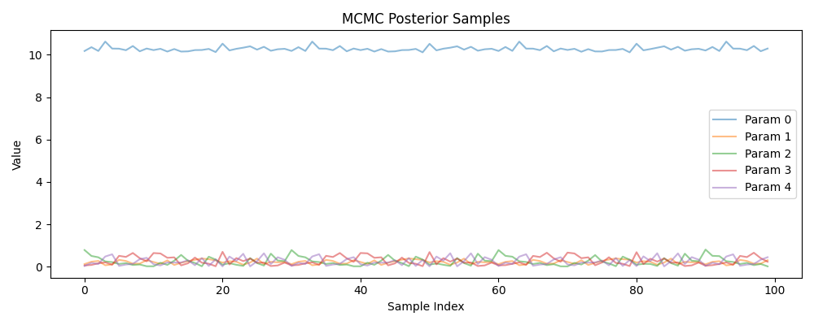

<div align="center">

</div>

---
configs:
- config_name: default
  data_dir: mmu_desi_provabgs/dataset
tags:
- astronomy
license: cc-by-4.0
pretty_name: mmu_desi_provabgs
size_categories:
- 100K<n<1M
---

# mmu_desi_provabgs HATS Catalog Collection

This is the collection of HATS catalogs representing mmu_desi_provabgs.

This dataset is part of the [Multimodal Universe](https://github.com/MultimodalUniverse/MultimodalUniverse),
a large-scale collection of multimodal astronomical data. For full details, see the paper:
[The Multimodal Universe: Enabling Large-Scale Machine Learning with 100TBs of Astronomical Scientific Data](https://arxiv.org/abs/2412.02527).


### Access the catalog

We recommend the use of the [LSDB](https://lsdb.io) Python framework to access HATS catalogs.
LSDB can be installed via `pip install lsdb` or `conda install conda-forge::lsdb`,
see more details [in the docs](https://docs.lsdb.io/).
The following code provides a minimal example of opening this catalog:

```python
import lsdb

# Full sky coverage.
catalog = lsdb.open_catalog("https://huggingface.co/datasets/UniverseTBD/mmu_desi_provabgs")
# One-degree cone.
catalog = lsdb.open_catalog(
    "https://huggingface.co/datasets/UniverseTBD/mmu_desi_provabgs",
    search_filter=lsdb.ConeSearch(ra=239.0, dec=43.0, radius_arcsec=3600.0),
)
```

Each catalog in this collection is represented as a separate [Apache Parquet dataset](https://arrow.apache.org/docs/python/dataset.html) and can be accessed with a variety of tools, including `pandas`, `pyarrow`, `dask`, `Spark`, `DuckDB`.

### File structure

This catalog is represented by the following files and directories:

- [`collection.properties`](https://huggingface.co/datasets/UniverseTBD/mmu_desi_provabgs/collection.properties) � textual metadata file describing the HATS collection of catalogs
- [`mmu_desi_provabgs`](https://huggingface.co/datasets/UniverseTBD/mmu_desi_provabgs/mmu_desi_provabgs) � main HATS catalog directory
  - [`dataset/`](https://huggingface.co/datasets/UniverseTBD/mmu_desi_provabgs/mmu_desi_provabgs/dataset/) � Apache Parquet dataset directory for the main catalog
    - ... parquet metadata and data files in sub directories ...
  - [`hats.properties`](https://huggingface.co/datasets/UniverseTBD/mmu_desi_provabgs/mmu_desi_provabgs/hats.properties) � textual metadata file describing the main HATS catalog
  - [`partition_info.csv`](https://huggingface.co/datasets/UniverseTBD/mmu_desi_provabgs/mmu_desi_provabgs/partition_info.csv) � CSV file with a list of catalog HEALPix tiles (catalog partitions)
  - [`skymap.fits`](https://huggingface.co/datasets/UniverseTBD/mmu_desi_provabgs/mmu_desi_provabgs/skymap.fits) � HEALPix skymap FITS file with row-counts per HEALPix tile of fixed order 10
- [`mmu_desi_provabgs_10arcs/`](https://huggingface.co/datasets/UniverseTBD/mmu_desi_provabgs/mmu_desi_provabgs_10arcs) � default margin catalog to ensure data completeness in cross-matching, the margin threshold is 10.0 arcseconds
  - ... margin catalog files and directories ...

### Catalog metadata

Metadata of the main HATS catalog, excluding margins and indexes:

| **Number of rows** | **Number of columns** | **Number of partitions** | **Size on disk** | **HATS Builder** |
| --- | --- | --- | --- | --- |
| 222,752 | 22 | 73 | 1.3 GiB | hats-import v0.7.3, hats v0.7.3 |


### Catalog columns

The main HATS catalog contains the following columns:

| **Name** |  **`_healpix_29`** | **`ra`** | **`dec`** | **`PROVABGS_MCMC`** | **`PROVABGS_THETA_BF`** | **`LOG_MSTAR`** | **`Z_HP`** | **`Z_MW`** | **`TAGE_MW`** | **`AVG_SFR`** | **`ZERR`** | **`TSNR2_BGS`** | **`MAG_G`** | **`MAG_R`** | **`MAG_Z`** | **`MAG_W1`** | **`FIBMAG_R`** | **`HPIX_64`** | **`PROVABGS_Z_MAX`** | **`SCHLEGEL_COLOR`** | **`PROVABGS_W_ZFAIL`** | **`PROVABGS_W_FIBASSIGN`** | **`object_id`** |
| --- |  --- | --- | --- | --- | --- | --- | --- | --- | --- | --- | --- | --- | --- | --- | --- | --- | --- | --- | --- | --- | --- | --- | --- |
| **Data Type** |  int64 | double | double | list<element: list<element: float>> | list<element: float> | float | float | float | float | float | float | float | float | float | float | float | float | float | float | float | float | float | string |
| **Value count** |  222,752 | 222,752 | 222,752 | *N/A* | 2,895,776 | 222,752 | 222,752 | 222,752 | 222,752 | 222,752 | 222,752 | 222,752 | 222,752 | 222,752 | 222,752 | 222,752 | 222,752 | 222,752 | 222,752 | 222,752 | 222,752 | 222,752 | 222,752 |
| **Example row** |  692306877918553052 | 239.2 | 43.23 | [[11.93, 0.1643, 0.052, 0.2078, � (13 total)], � (100 total)] | [12.2, 0.241, 0.1054, 0.4592, � (13 total)] | 11.95 | 0.3776 | 0.001392 | 8.849 | 14.35 | 1.459e-05 | 1514 | 21.37 | 20.23 | 19.48 | 18.88 | 21.04 | 9838 | 0.4418 | 0.4294 | 1.008 | 1 | 39633136480420008 |
| **Minimum value** |  643521053811880247 | 148.40325927734375 | -2.3291468620300293 | *N/A* | -2.0 | 6.238491058349609 | 1.4423111679207068e-05 | 4.4905984395882115e-05 | 0.014555543661117554 | 8.957725782920284e-14 | 2.9781909915982396e-07 | 223.89047241210938 | 12.553780555725098 | 12.053372383117676 | 11.390754699707031 | 11.869658470153809 | 14.953400611877441 | 9144.0 | 0.0008533737855032086 | -23.969953536987305 | 1.0 | 1.0 | 39627733927462296 |
| **Maximum value** |  1981011982237869960 | 273.93377685546875 | 67.75138854980469 | *N/A* | 13.269999504089355 | 12.770240783691406 | 0.5997362732887268 | 0.04490434378385544 | 12.506219863891602 | 2095.118896484375 | 0.0006934804259799421 | 205831.9375 | 22.785625457763672 | 20.299989700317383 | 21.06035804748535 | 40.0 | 22.896602630615234 | 28151.0 | 0.6000000238418579 | 6.442105293273926 | 3.547720432281494 | 129.0 | 39633470523181151 |


"Value count" may be different from the total number of rows for nested columns: each nested element is counted as a single value.


### Crossmatch with another catalog

HATS catalogs can be efficiently crossmatched using [LSDB](https://lsdb.io),
which leverages the HEALPix partitioning to avoid loading the full datasets into memory:

```python
import lsdb

mmu_desi_provabgs = lsdb.open_catalog("https://huggingface.co/datasets/UniverseTBD/mmu_desi_provabgs")
other = lsdb.open_catalog("https://huggingface.co/datasets/<org>/<other_catalog>")

crossmatched = mmu_desi_provabgs.crossmatch(other, radius_arcsec=1.0)
print(crossmatched)
```

See the [LSDB documentation](https://docs.lsdb.io/) for more details on crossmatching and other operations.

### Dataset-specific context

**Original survey**  
This dataset is based on the [DESI Bright Galaxy Survey (BGS)](https://arxiv.org/pdf/2208.08512), specifically using data from the Early Data Release (EDR). The PROVABGS catalog reports inferred galaxy properties for spectra in this sample.

**Data modality**  
The dataset consists of tabular data containing galaxy physical properties derived from Spectral Energy Distribution (SED) modeling, such as log stellar mass, star formation rate, mass-weighted stellar metallicity, and mass-weighted stellar age. It also includes samples from the posterior distribution for each object.

**Typical use cases**  
The dataset has been used for physical property estimation from both images and spectra in self-supervised and supervised learning contexts.

**Caveats**  
The dataset is based on the DESI Early Data Release (EDR). The reported properties are inferred using Bayesian inference and SED modeling, rather than being directly observed quantities.

**Citation**  
Users should acknowledge the PROVABGS dataset and the DESI collaboration. The data is publicly available.
