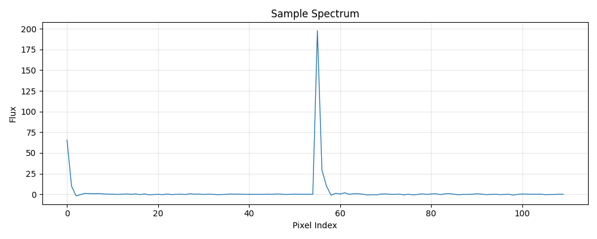

---
configs:
- config_name: default
  data_dir: mmu_gaia_gaia/dataset
tags:
- astronomy
license: cc-by-4.0
pretty_name: mmu_gaia_gaia
size_categories:
- 100M<n<1B
---

<div align="center">

</div>

# mmu_gaia_gaia HATS Catalog Collection

This is the collection of HATS catalogs representing mmu_gaia_gaia.

This dataset is part of the [Multimodal Universe](https://github.com/MultimodalUniverse/MultimodalUniverse),
a large-scale collection of multimodal astronomical data. For full details, see the paper:
[The Multimodal Universe: Enabling Large-Scale Machine Learning with 100TBs of Astronomical Scientific Data](https://arxiv.org/abs/2412.02527).

### Access the catalog

We recommend the use of the [LSDB](https://lsdb.io) Python framework to access HATS catalogs.
LSDB can be installed via `pip install lsdb` or `conda install conda-forge::lsdb`,
see more details [in the docs](https://docs.lsdb.io/).
The following code provides a minimal example of opening this catalog:

```python
import lsdb

# Full sky coverage.
catalog = lsdb.open_catalog("https://huggingface.co/datasets/UniverseTBD/mmu_gaia_gaia")
# One-degree cone.
catalog = lsdb.open_catalog(
    "https://huggingface.co/datasets/UniverseTBD/mmu_gaia_gaia",
    search_filter=lsdb.ConeSearch(ra=216.0, dec=62.0, radius_arcsec=3600.0),
)
```

Each catalog in this collection is represented as a separate [Apache Parquet dataset](https://arrow.apache.org/docs/python/dataset.html) and can be accessed with a variety of tools, including `pandas`, `pyarrow`, `dask`, `Spark`, `DuckDB`.

### File structure

This catalog is represented by the following files and directories:

- [`collection.properties`](https://huggingface.co/datasets/UniverseTBD/mmu_gaia_gaia/collection.properties) — textual metadata file describing the HATS collection of catalogs
- [`mmu_gaia_gaia`](https://huggingface.co/datasets/UniverseTBD/mmu_gaia_gaia/mmu_gaia_gaia) — main HATS catalog directory
  - [`dataset/`](https://huggingface.co/datasets/UniverseTBD/mmu_gaia_gaia/mmu_gaia_gaia/dataset/) — Apache Parquet dataset directory for the main catalog
    - ... parquet metadata and data files in sub directories ...
  - [`hats.properties`](https://huggingface.co/datasets/UniverseTBD/mmu_gaia_gaia/mmu_gaia_gaia/hats.properties) — textual metadata file describing the main HATS catalog
  - [`partition_info.csv`](https://huggingface.co/datasets/UniverseTBD/mmu_gaia_gaia/mmu_gaia_gaia/partition_info.csv) — CSV file with a list of catalog HEALPix tiles (catalog partitions)
  - [`skymap.fits`](https://huggingface.co/datasets/UniverseTBD/mmu_gaia_gaia/mmu_gaia_gaia/skymap.fits) — HEALPix skymap FITS file with row-counts per HEALPix tile of fixed order 10
- [`mmu_gaia_gaia_10arcs/`](https://huggingface.co/datasets/UniverseTBD/mmu_gaia_gaia/mmu_gaia_gaia_10arcs) — default margin catalog to ensure data completeness in cross-matching, the margin threshold is 10.0 arcseconds
  - ... margin catalog files and directories ...

### Catalog metadata

Metadata of the main HATS catalog, excluding margins and indexes:

| **Number of rows** | **Number of columns** | **Number of partitions** | **Size on disk** | **HATS Builder** |
| --- | --- | --- | --- | --- |
| 122,302,572 | 11 | 33,055 | 162.5 GiB | hats-import v0.7.3, hats v0.7.3 |


### Catalog columns

The main HATS catalog contains the following columns:

| **Name** |  **`_healpix_29`** | **`spectral_coefficients.coeff`** | **`spectral_coefficients.coeff_error`** | **`photometry`** | **`astrometry`** | **`radial_velocity`** | **`gspphot`** | **`flags`** | **`corrections`** | **`ra`** | **`dec`** | **`healpix`** | **`object_id`** |
| --- |  --- | --- | --- | --- | --- | --- | --- | --- | --- | --- | --- | --- | --- |
| **Data Type** |  int64 | list[float] | list[float] | struct<phot_g_mean_mag: float, phot_g_mean_flux: float, phot_g_mean_flux_error: float, phot_bp_mean_mag: float, phot_bp_mean_flux: float, phot_bp_mean_flux_error: float, phot_rp_mean_mag: float, phot_rp_mean_flux: float, phot_rp_mean_flux_error: float, phot_bp_rp_excess_factor: float, bp_rp: float, bp_g: float, g_rp: float> | struct<ra: float, ra_error: float, dec: float, dec_error: float, parallax: float, parallax_error: float, pmra: float, pmra_error: float, pmdec: float, pmdec_error: float, ra_dec_corr: float, ra_parallax_corr: float, ra_pmra_corr: float, ra_pmdec_corr: float, dec_parallax_corr: float, dec_pmra_corr: float, dec_pmdec_corr: float, parallax_pmra_corr: float, parallax_pmdec_corr: float, pmra_pmdec_corr: float> | struct<radial_velocity: float, radial_velocity_error: float, rv_template_fe_h: float, rv_template_logg: float, rv_template_teff: float> | struct<ag_gspphot: float, ag_gspphot_lower: float, ag_gspphot_upper: float, azero_gspphot: float, azero_gspphot_lower: float, azero_gspphot_upper: float, distance_gspphot: float, distance_gspphot_lower: float, distance_gspphot_upper: float, ebpminrp_gspphot: float, ebpminrp_gspphot_lower: float, ebpminrp_gspphot_upper: float, logg_gspphot: float, logg_gspphot_lower: float, logg_gspphot_upper: float, mh_gspphot: float, mh_gspphot_lower: float, mh_gspphot_upper: float, teff_gspphot: float, teff_gspphot_lower: float, teff_gspphot_upper: float> | struct<ruwe: float> | struct<ecl_lat: float, ecl_lon: float, nu_eff_used_in_astrometry: float, pseudocolour: float, astrometric_params_solved: float, rv_template_teff: float, grvs_mag: float> | double | double | int64 | int64 |
| **Nested?** |  — | spectral_coefficients | spectral_coefficients | — | — | — | — | — | — | — | — | — | — |
| **Value count** |  122,302,572 | 13,453,282,920 | 13,453,282,920 | *N/A* | *N/A* | *N/A* | *N/A* | *N/A* | *N/A* | 122,302,572 | 122,302,572 | 122,302,572 | 122,302,572 |
| **Example row** |  833383574405302936 | [451.8, -54.73, -11.98, 6.172, … (110 total)] | [0.8788, 0.7534, 0.8016, 0.797, … (110 total)] | {'phot_g_mean_mag': 16.072418212890625, 'phot_g_mean_flux': 7014.2216… | {'ra': 215.82135009765625, 'ra_error': 0.02989613451063633, 'dec': 62… | {'radial_velocity': nan, 'radial_velocity_error': nan, 'rv_template_f… | {'ag_gspphot': 0.005200000014156103, 'ag_gspphot_lower': 0.0013000000… | {'ruwe': 1.0111064910888672} | {'ecl_lat': 67.04853820800781, 'ecl_lon': 164.61669921875, 'nu_eff_us… | 215.8 | 62.37 | 740 | 1666767135588491904 |
| **Minimum value** |  3.121e+09 | -4.102e+07 | 0.00878 | *N/A* | *N/A* | *N/A* | *N/A* | *N/A* | *N/A* | 1.633e-06 | -89.99 | 0 | 4.296e+09 |
| **Maximum value** |  3.459e+18 | 1.181e+08 | 8.353e+06 | *N/A* | *N/A* | *N/A* | *N/A* | *N/A* | *N/A* | 360 | 88.52 | 3071 | 6.918e+18 |


"Nested" indicates whether the column is stored as a nested field inside another "struct" column.


"Value count" may be different from the total number of rows for nested columns: each nested element is counted as a single value.


### Crossmatch with another catalog

HATS catalogs can be efficiently crossmatched using [LSDB](https://lsdb.io),
which leverages the HEALPix partitioning to avoid loading the full datasets into memory:

```python
import lsdb

mmu_gaia_gaia = lsdb.open_catalog("https://huggingface.co/datasets/UniverseTBD/mmu_gaia_gaia")
other = lsdb.open_catalog("https://huggingface.co/datasets/<org>/<other_catalog>")

crossmatched = mmu_gaia_gaia.crossmatch(other, radius_arcsec=1.0)
print(crossmatched)
```

See the [LSDB documentation](https://docs.lsdb.io/) for more details on crossmatching and other operations.

### Dataset-specific context

**Original survey**  
This dataset is based on the [Gaia mission](https://www.cosmos.esa.int/gaia), specifically Data Release 3 (DR3). Gaia is designed to measure the astrometry of stars in the Milky Way, including positions, parallaxes, and proper motions, along with additional measurements such as photometry, physical parameters, and spectra.

**Data modality**  
The dataset is multimodal and includes stellar spectra, astrometric measurements (such as positions, parallaxes, and proper motions), photometry (magnitudes and fluxes), photometrically-estimated stellar parameters (e.g., distance, surface
gravity, metallicity, surface temperature) , and radial velocities, along with associated uncertainties and quality flags.

**Typical use cases**  
The dataset has been widely used in Milky Way science and machine learning applications, including identifying non-axisymmetric features in the Galactic disc, constructing chemodynamical maps, and training models to generate stellar spectra, estimate physical parameters, and inpaint missing spectral regions.

**Caveats**  
The dataset includes a subset of 220 million stars from DR3 for which BP/RP spectra are available, rather than the full set of nearly 2 billion sources.

**Citation**  
Users should acknowledge the [European Space Agency (ESA) Gaia mission](https://www.cosmos.esa.int/gaia) and the Gaia Data Processing and Analysis Consortium (DPAC). The data are open and free to use provided appropriate credit is given.
