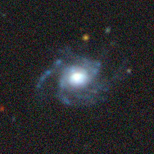

---
configs:
- config_name: default
  data_dir: mmu_gz10/dataset
tags:
- astronomy
license: cc-by-4.0
pretty_name: mmu_gz10
size_categories:
- 10K<n<100K
---

<div align="center">

</div>

# mmu_gz10 HATS Catalog Collection

This is the collection of HATS catalogs representing mmu_gz10.

This dataset is part of the [Multimodal Universe](https://github.com/MultimodalUniverse/MultimodalUniverse),
a large-scale collection of multimodal astronomical data. For full details, see the paper:
[The Multimodal Universe: Enabling Large-Scale Machine Learning with 100TBs of Astronomical Scientific Data](https://arxiv.org/abs/2412.02527).

### Access the catalog

We recommend the use of the [LSDB](https://lsdb.io) Python framework to access HATS catalogs.
LSDB can be installed via `pip install lsdb` or `conda install conda-forge::lsdb`,
see more details [in the docs](https://docs.lsdb.io/).
The following code provides a minimal example of opening this catalog:

```python
import lsdb

# Full sky coverage.
catalog = lsdb.open_catalog("https://huggingface.co/datasets/UniverseTBD/mmu_gz10")
# One-degree cone.
catalog = lsdb.open_catalog(
    "https://huggingface.co/datasets/UniverseTBD/mmu_gz10",
    search_filter=lsdb.ConeSearch(ra=134.0, dec=39.0, radius_arcsec=3600.0),
)
```

Each catalog in this collection is represented as a separate [Apache Parquet dataset](https://arrow.apache.org/docs/python/dataset.html) and can be accessed with a variety of tools, including `pandas`, `pyarrow`, `dask`, `Spark`, `DuckDB`.

### File structure

This catalog is represented by the following files and directories:

- [`collection.properties`](https://huggingface.co/datasets/UniverseTBD/mmu_gz10/collection.properties) � textual metadata file describing the HATS collection of catalogs
- [`mmu_gz10`](https://huggingface.co/datasets/UniverseTBD/mmu_gz10/mmu_gz10) � main HATS catalog directory
  - [`dataset/`](https://huggingface.co/datasets/UniverseTBD/mmu_gz10/mmu_gz10/dataset/) � Apache Parquet dataset directory for the main catalog
    - ... parquet metadata and data files in sub directories ...
  - [`hats.properties`](https://huggingface.co/datasets/UniverseTBD/mmu_gz10/mmu_gz10/hats.properties) � textual metadata file describing the main HATS catalog
  - [`partition_info.csv`](https://huggingface.co/datasets/UniverseTBD/mmu_gz10/mmu_gz10/partition_info.csv) � CSV file with a list of catalog HEALPix tiles (catalog partitions)
  - [`skymap.fits`](https://huggingface.co/datasets/UniverseTBD/mmu_gz10/mmu_gz10/skymap.fits) � HEALPix skymap FITS file with row-counts per HEALPix tile of fixed order 10
- [`mmu_gz10_10arcs/`](https://huggingface.co/datasets/UniverseTBD/mmu_gz10/mmu_gz10_10arcs) � default margin catalog to ensure data completeness in cross-matching, the margin threshold is 10.0 arcseconds
  - ... margin catalog files and directories ...

### Catalog metadata

Metadata of the main HATS catalog, excluding margins and indexes:

| **Number of rows** | **Number of columns** | **Number of partitions** | **Size on disk** | **HATS Builder** |
| --- | --- | --- | --- | --- |
| 17,736 | 7 | 766 | 2.6 GiB | hats-import v0.7.3, hats v0.7.3 |


### Catalog columns

The main HATS catalog contains the following columns:

| **Name** |  **`_healpix_29`** | **`rgb_image`** | **`gz10_label`** | **`redshift`** | **`rgb_pixel_scale`** | **`ra`** | **`dec`** | **`object_id`** |
| --- |  --- | --- | --- | --- | --- | --- | --- | --- |
| **Data Type** |  int64 | struct<bytes: binary, path: string> | int32 | float | float | double | double | string |
| **Null count** |  0 | *N/A* | 0 | 0 | 0 | 0 | 0 | 0 |
| **Example row** |  359965024263830453 | {'bytes': b'\x89PNG\r\n\x1a\n\x00\x00\x00\rIHDR\x00\x00\x01\x00\x00\x� | 0 | 0.08629 | 0.262 | 133.7 | 39.42 | 521 |
| **Minimum value** |  11240848558758 | *N/A* | 0 | -0.0001244 | 0.262 | 0.007269 | -19.05 | 0 |
| **Maximum value** |  3458656132606848812 | *N/A* | 9 | 1.442 | 0.524 | 360 | 69.77 | 9999 |


### Crossmatch with another catalog

HATS catalogs can be efficiently crossmatched using [LSDB](https://lsdb.io),
which leverages the HEALPix partitioning to avoid loading the full datasets into memory:

```python
import lsdb

mmu_gz10 = lsdb.open_catalog("https://huggingface.co/datasets/UniverseTBD/mmu_gz10")
other = lsdb.open_catalog("https://huggingface.co/datasets/<org>/<other_catalog>")

crossmatched = mmu_gz10.crossmatch(other, radius_arcsec=1.0)
print(crossmatched)
```

See the [LSDB documentation](https://docs.lsdb.io/) for more details on crossmatching and other operations.

### Dataset-specific context

**Original survey**  
This dataset is based on [Galaxy Zoo](https://www.zooniverse.org/projects/zookeeper/galaxy-zoo/), a citizen science project where volunteers classify galaxy images according to their structure. The images are derived from the DESI Legacy Imaging Survey and correspond to what volunteers used for classification.

**Data modality**  
The dataset includes RGB galaxy images (3×256×256) along with classification labels into 10 morphological classes. It also provides auxiliary tabular data such as right ascension (ra), declination (dec), redshift, and object identifiers.

**Typical use cases**  
The dataset is mainly used for benchmarking and developing models for galaxy morphology classification, using clean and simplified labels. Several publications have used this dataset for evaluating different approaches (see [examples](https://astronn.readthedocs.io/en/latest/galaxy10.html#some-papers-that-used-galaxy-10)).

**Caveats**  
The dataset includes only a subset of Galaxy Zoo data with confident and clearly distinguishable labels. The images are RGB composites designed for visualization and classification, rather than full scientific measurements.

**Citation**  
Users should acknowledge the Galaxy Zoo project and the DESI Legacy Imaging Surveys.
