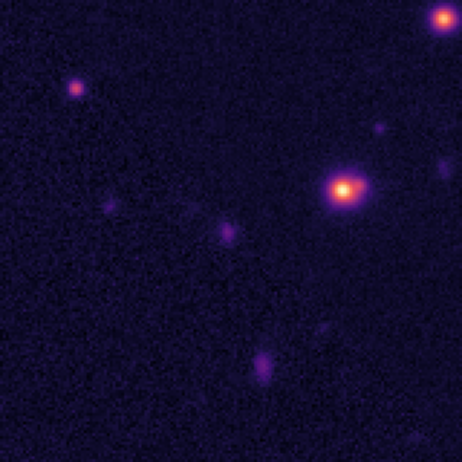

<div align="center">

</div>

---
configs:
- config_name: default
  data_dir: mmu_hsc_pdr3_dud_22.5/dataset
tags:
- astronomy
license: cc-by-4.0
pretty_name: mmu_hsc_pdr3_dud_22.5
size_categories:
- 100K<n<1M
---

# mmu_hsc_pdr3_dud_22.5 HATS Catalog Collection

This is the collection of HATS catalogs representing mmu_hsc_pdr3_dud_22.5.

This dataset is part of the [Multimodal Universe](https://github.com/MultimodalUniverse/MultimodalUniverse),
a large-scale collection of multimodal astronomical data. For full details, see the paper:
[The Multimodal Universe: Enabling Large-Scale Machine Learning with 100TBs of Astronomical Scientific Data](https://arxiv.org/abs/2412.02527).

### Access the catalog

We recommend the use of the [LSDB](https://lsdb.io) Python framework to access HATS catalogs.
LSDB can be installed via `pip install lsdb` or `conda install conda-forge::lsdb`,
see more details [in the docs](https://docs.lsdb.io/).
The following code provides a minimal example of opening this catalog:

```python
import lsdb

# Full sky coverage.
catalog = lsdb.open_catalog("https://huggingface.co/datasets/UniverseTBD/mmu_hsc_pdr3_dud_22.5")
# One-degree cone.
catalog = lsdb.open_catalog(
    "https://huggingface.co/datasets/UniverseTBD/mmu_hsc_pdr3_dud_22.5",
    search_filter=lsdb.ConeSearch(ra=242.0, dec=55.0, radius_arcsec=3600.0),
)
```

Each catalog in this collection is represented as a separate [Apache Parquet dataset](https://arrow.apache.org/docs/python/dataset.html) and can be accessed with a variety of tools, including `pandas`, `pyarrow`, `dask`, `Spark`, `DuckDB`.

### File structure

This catalog is represented by the following files and directories:

- [`collection.properties`](https://huggingface.co/datasets/UniverseTBD/mmu_hsc_pdr3_dud_22.5/collection.properties) � textual metadata file describing the HATS collection of catalogs
- [`mmu_hsc_pdr3_dud_22.5`](https://huggingface.co/datasets/UniverseTBD/mmu_hsc_pdr3_dud_22.5/mmu_hsc_pdr3_dud_22.5) � main HATS catalog directory
  - [`dataset/`](https://huggingface.co/datasets/UniverseTBD/mmu_hsc_pdr3_dud_22.5/mmu_hsc_pdr3_dud_22.5/dataset/) � Apache Parquet dataset directory for the main catalog
    - ... parquet metadata and data files in sub directories ...
  - [`hats.properties`](https://huggingface.co/datasets/UniverseTBD/mmu_hsc_pdr3_dud_22.5/mmu_hsc_pdr3_dud_22.5/hats.properties) � textual metadata file describing the main HATS catalog
  - [`partition_info.csv`](https://huggingface.co/datasets/UniverseTBD/mmu_hsc_pdr3_dud_22.5/mmu_hsc_pdr3_dud_22.5/partition_info.csv) � CSV file with a list of catalog HEALPix tiles (catalog partitions)
  - [`skymap.fits`](https://huggingface.co/datasets/UniverseTBD/mmu_hsc_pdr3_dud_22.5/mmu_hsc_pdr3_dud_22.5/skymap.fits) � HEALPix skymap FITS file with row-counts per HEALPix tile of fixed order 10
- [`mmu_hsc_pdr3_dud_22.5_10arcs/`](https://huggingface.co/datasets/UniverseTBD/mmu_hsc_pdr3_dud_22.5/mmu_hsc_pdr3_dud_22.5_10arcs) � default margin catalog to ensure data completeness in cross-matching, the margin threshold is 10.0 arcseconds
  - ... margin catalog files and directories ...

### Catalog metadata

Metadata of the main HATS catalog, excluding margins and indexes:

| **Number of rows** | **Number of columns** | **Number of partitions** | **Size on disk** | **HATS Builder** |
| --- | --- | --- | --- | --- |
| 474,954 | 54 | 156 | 335.6 GiB | hats-import v0.7.3, hats v0.7.3 |


### Catalog columns

The main HATS catalog contains the following columns:

| **Name** |  **`_healpix_29`** | **`image.band`** | **`image.flux`** | **`image.ivar`** | **`image.mask`** | **`image.psf_fwhm`** | **`image.scale`** | **`a_g`** | **`a_r`** | **`a_i`** | **`a_z`** | **`a_y`** | **`g_extendedness_value`** | **`r_extendedness_value`** | **`i_extendedness_value`** | **`z_extendedness_value`** | **`y_extendedness_value`** | **`g_cmodel_mag`** | **`g_cmodel_magerr`** | **`r_cmodel_mag`** | **`r_cmodel_magerr`** | **`i_cmodel_mag`** | **`i_cmodel_magerr`** | **`z_cmodel_mag`** | **`z_cmodel_magerr`** | **`y_cmodel_mag`** | **`y_cmodel_magerr`** | **`g_sdssshape_psf_shape11`** | **`g_sdssshape_psf_shape22`** | **`g_sdssshape_psf_shape12`** | **`r_sdssshape_psf_shape11`** | **`r_sdssshape_psf_shape22`** | **`r_sdssshape_psf_shape12`** | **`i_sdssshape_psf_shape11`** | **`i_sdssshape_psf_shape22`** | **`i_sdssshape_psf_shape12`** | **`z_sdssshape_psf_shape11`** | **`z_sdssshape_psf_shape22`** | **`z_sdssshape_psf_shape12`** | **`y_sdssshape_psf_shape11`** | **`y_sdssshape_psf_shape22`** | **`y_sdssshape_psf_shape12`** | **`g_sdssshape_shape11`** | **`g_sdssshape_shape22`** | **`g_sdssshape_shape12`** | **`r_sdssshape_shape11`** | **`r_sdssshape_shape22`** | **`r_sdssshape_shape12`** | **`i_sdssshape_shape11`** | **`i_sdssshape_shape22`** | **`i_sdssshape_shape12`** | **`z_sdssshape_shape11`** | **`z_sdssshape_shape22`** | **`z_sdssshape_shape12`** | **`y_sdssshape_shape11`** | **`y_sdssshape_shape22`** | **`y_sdssshape_shape12`** | **`ra`** | **`dec`** | **`object_id`** |
| --- |  --- | --- | --- | --- | --- | --- | --- | --- | --- | --- | --- | --- | --- | --- | --- | --- | --- | --- | --- | --- | --- | --- | --- | --- | --- | --- | --- | --- | --- | --- | --- | --- | --- | --- | --- | --- | --- | --- | --- | --- | --- | --- | --- | --- | --- | --- | --- | --- | --- | --- | --- | --- | --- | --- | --- | --- | --- | --- | --- | --- |
| **Data Type** |  int64 | list[string] | list[list<element: list<element: float>>] | list[list<element: list<element: float>>] | list[list<element: list<element: bool>>] | list[float] | list[float] | float | float | float | float | float | float | float | float | float | float | float | float | float | float | float | float | float | float | float | float | float | float | float | float | float | float | float | float | float | float | float | float | float | float | float | float | float | float | float | float | float | float | float | float | float | float | float | float | float | float | double | double | string |
| **Nested?** |  � | image | image | image | image | image | image | � | � | � | � | � | � | � | � | � | � | � | � | � | � | � | � | � | � | � | � | � | � | � | � | � | � | � | � | � | � | � | � | � | � | � | � | � | � | � | � | � | � | � | � | � | � | � | � | � | � | � | � | � |
| **Value count** |  474,954 | 2,374,770 | *N/A* | *N/A* | *N/A* | 2,374,770 | 2,374,770 | 474,954 | 474,954 | 474,954 | 474,954 | 474,954 | 474,954 | 474,954 | 474,954 | 474,954 | 474,954 | 474,954 | 474,954 | 474,954 | 474,954 | 474,954 | 474,954 | 474,954 | 474,954 | 474,954 | 474,954 | 474,954 | 474,954 | 474,954 | 474,954 | 474,954 | 474,954 | 474,954 | 474,954 | 474,954 | 474,954 | 474,954 | 474,954 | 474,954 | 474,954 | 474,954 | 474,954 | 474,954 | 474,954 | 474,954 | 474,954 | 474,954 | 474,954 | 474,954 | 474,954 | 474,954 | 474,954 | 474,954 | 474,954 | 474,954 | 474,954 | 474,954 | 474,954 | 474,954 |
| **Example row** |  714608920907664824 | [hsc-g, hsc-r, hsc-i, hsc-z, hsc-y] | [[[0.01553, 0.01353, 0.04066, � (160 total)], � (160 total)], � (5 to� | [[[6186, 6202, 6196, 6281, 6295, � (160 total)], � (160 total)], � (5� | [[[True, True, True, True, True, � (160 total)], � (160 total)], � (5� | [0.6551, 0.7859, 0.584, 0.6869, � (5 total)] | [0.168, 0.168, 0.168, 0.168, 0.168] | 0.02099 | 0.01475 | 0.01058 | 0.008184 | 0.006966 | 1 | 1 | 1 | 1 | 1 | 22.12 | 0.002044 | 21.82 | 0.002492 | 21.62 | 0.002321 | 21.52 | 0.004113 | 21.45 | 0.009543 | 0.07804 | 0.07675 | -0.001801 | 0.1104 | 0.1124 | -0.0007987 | 0.06518 | 0.05811 | 0.002674 | 0.08575 | 0.08443 | -0.001878 | 0.09401 | 0.09101 | 0.004777 | 0.1922 | 0.204 | 0.05422 | 0.2435 | 0.2615 | 0.05549 | 0.1893 | 0.196 | 0.0582 | 0.2264 | 0.2352 | 0.05529 | 0.2284 | 0.2484 | 0.05748 | 242.2 | 54.85 | 75339253994786944 |
| **Minimum value** |  713959823852017263 | hsc-g | *N/A* | *N/A* | *N/A* | -0.0 | 0.1679999977350235 | 0.014865555800497532 | 0.010442594066262245 | 0.007492423988878727 | 0.005794813856482506 | 0.004932244773954153 | -0.0 | -0.0 | -0.0 | -0.0 | -0.0 | 13.40178108215332 | 5.988774501020089e-05 | 15.156841278076172 | 4.929747592541389e-05 | 12.742855072021484 | 3.227664274163544e-05 | 14.046401977539062 | 3.8605219742748886e-05 | 11.048727035522461 | 5.5523487390019e-05 | 0.002351417439058423 | 0.0023516854271292686 | -1.1424497365951538 | 0.03563915193080902 | 0.007416512351483107 | -0.3677349090576172 | 0.026111777871847153 | 0.031780991703271866 | -0.4359694719314575 | 0.020980196073651314 | 0.03532128408551216 | -0.4710213541984558 | 0.03327632322907448 | 0.03366565331816673 | -0.02028796635568142 | 0.0015113428235054016 | 0.000953439564909786 | -27798.8203125 | 0.0003241318336222321 | 0.0019716571550816298 | -6958.20068359375 | -0.3635726273059845 | 0.002350886119529605 | -10027.140625 | -8.943077087402344 | 0.00019998368225060403 | -4239.42626953125 | -0.002925257198512554 | 0.0018239404307678342 | -13199.34375 | 33.606262488492874 | -6.082362086730274 | 36429191050166698 |
| **Maximum value** |  1924448822636503838 | hsc-z | *N/A* | *N/A* | *N/A* | 4.95881462097168 | 0.1679999977350235 | 0.20999060571193695 | 0.14751191437244415 | 0.1058378592133522 | 0.08185745030641556 | 0.06967281550168991 | 1.0 | 1.0 | 1.0 | 1.0 | 1.0 | inf | inf | inf | inf | 22.499998092651367 | inf | inf | inf | inf | inf | 1.708125114440918 | 1.8359121084213257 | 0.08827947825193405 | 1.164284586906433 | 0.4658052623271942 | 0.7985565066337585 | 4.0367865562438965 | 4.870001316070557 | 0.03867558762431145 | 1.1716283559799194 | 1.332167387008667 | 0.059275317937135696 | 0.29171323776245117 | 0.32067495584487915 | 0.13825233280658722 | 28392.671875 | 37255.6015625 | 2947.21435546875 | 12577.33984375 | 16102.716796875 | 2831.651123046875 | 21279.3046875 | 15267.2314453125 | 3927.672607421875 | 1384974.125 | 243522.625 | 917168.0 | 16140.8369140625 | 13590.5048828125 | 6681.443359375 | 353.9145417236136 | 56.82558416535321 | 76557903720361081 |


"Nested" indicates whether the column is stored as a nested field inside another "struct" column.


"Value count" may be different from the total number of rows for nested columns: each nested element is counted as a single value.


### Crossmatch with another catalog

HATS catalogs can be efficiently crossmatched using [LSDB](https://lsdb.io),
which leverages the HEALPix partitioning to avoid loading the full datasets into memory:

```python
import lsdb

mmu_hsc_pdr3_dud_22.5 = lsdb.open_catalog("https://huggingface.co/datasets/UniverseTBD/mmu_hsc_pdr3_dud_22.5")
other = lsdb.open_catalog("https://huggingface.co/datasets/<org>/<other_catalog>")

crossmatched = mmu_hsc_pdr3_dud_22.5.crossmatch(other, radius_arcsec=1.0)
print(crossmatched)
```

See the [LSDB documentation](https://docs.lsdb.io/) for more details on crossmatching and other operations.

### Dataset-specific context

**Original survey**  
This dataset is based on the Hyper Suprime-Cam Subaru Strategic Program (HSC-SSP), a wide-field imaging survey conducted with the Hyper Suprime-Cam on the Subaru Telescope. It uses data from the Deep and UltraDeep fields of the third Public Data Release [(PDR3)](https://arxiv.org/pdf/2108.13045), which cover a smaller area of the sky but provide deeper (lower-noise) observations.

**Data modality**  
The dataset consists of multi-band image cutouts (160 × 160 pixels) in five optical bands (g, r, i, z, y), extracted from larger survey images. Each cutout is centered on an object and is associated with measurements from the survey’s analysis pipeline. The dataset contains approximately 400,000 objects.

**Typical use cases**  
This dataset can be used for machine learning applications on astronomical images, such as detecting rare objects, classifying sources, or characterizing galaxy properties.

**Caveats**  
The dataset is restricted to the Deep/UltraDeep fields, which cover a relatively small area of the sky compared to the full survey, although with deeper (lower-noise) observations. In addition, the sample is constructed using selection criteria such as magnitude limits, requiring multiple observations across all bands, and removing objects affected by artifacts or unreliable measurements. As a result, the dataset may not fully represent the broader survey.

**Citation**  
Data from the HSC-SSP can be used under the conditions specified by the survey. Users should include the credit *“NAOJ / HSC Collaboration”* and follow the [usage terms](https://www.nao.ac.jp/en/terms/copyright.html).
