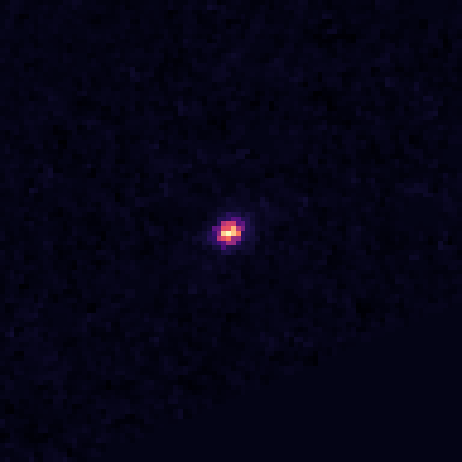

---
configs:
- config_name: default
  data_dir: mmu_jwst_ngdeep/dataset
tags:
- astronomy
license: cc-by-4.0
pretty_name: mmu_jwst_ngdeep
size_categories:
- 1K<n<10K
---

<div align="center">

</div>

# mmu_jwst_ngdeep HATS Catalog Collection

This is the collection of HATS catalogs representing mmu_jwst_ngdeep.

This dataset is part of the [Multimodal Universe](https://github.com/MultimodalUniverse/MultimodalUniverse),
a large-scale collection of multimodal astronomical data. For full details, see the paper:
[The Multimodal Universe: Enabling Large-Scale Machine Learning with 100TBs of Astronomical Scientific Data](https://arxiv.org/abs/2412.02527).

### Access the catalog

We recommend the use of the [LSDB](https://lsdb.io) Python framework to access HATS catalogs.
LSDB can be installed via `pip install lsdb` or `conda install conda-forge::lsdb`,
see more details [in the docs](https://docs.lsdb.io/).
The following code provides a minimal example of opening this catalog:

```python
import lsdb

# Full sky coverage.
catalog = lsdb.open_catalog("https://huggingface.co/datasets/UniverseTBD/mmu_jwst_ngdeep")
# One-degree cone.
catalog = lsdb.open_catalog(
    "https://huggingface.co/datasets/UniverseTBD/mmu_jwst_ngdeep",
    search_filter=lsdb.ConeSearch(ra=53.0, dec=-28.0, radius_arcsec=3600.0),
)
```

Each catalog in this collection is represented as a separate [Apache Parquet dataset](https://arrow.apache.org/docs/python/dataset.html) and can be accessed with a variety of tools, including `pandas`, `pyarrow`, `dask`, `Spark`, `DuckDB`.

### File structure

This catalog is represented by the following files and directories:

- [`collection.properties`](https://huggingface.co/datasets/UniverseTBD/mmu_jwst_ngdeep/collection.properties) � textual metadata file describing the HATS collection of catalogs
- [`mmu_jwst_ngdeep`](https://huggingface.co/datasets/UniverseTBD/mmu_jwst_ngdeep/mmu_jwst_ngdeep) � main HATS catalog directory
  - [`dataset/`](https://huggingface.co/datasets/UniverseTBD/mmu_jwst_ngdeep/mmu_jwst_ngdeep/dataset/) � Apache Parquet dataset directory for the main catalog
    - ... parquet metadata and data files in sub directories ...
  - [`hats.properties`](https://huggingface.co/datasets/UniverseTBD/mmu_jwst_ngdeep/mmu_jwst_ngdeep/hats.properties) � textual metadata file describing the main HATS catalog
  - [`partition_info.csv`](https://huggingface.co/datasets/UniverseTBD/mmu_jwst_ngdeep/mmu_jwst_ngdeep/partition_info.csv) � CSV file with a list of catalog HEALPix tiles (catalog partitions)
  - [`skymap.fits`](https://huggingface.co/datasets/UniverseTBD/mmu_jwst_ngdeep/mmu_jwst_ngdeep/skymap.fits) � HEALPix skymap FITS file with row-counts per HEALPix tile of fixed order 10
- [`mmu_jwst_ngdeep_10arcs/`](https://huggingface.co/datasets/UniverseTBD/mmu_jwst_ngdeep/mmu_jwst_ngdeep_10arcs) � default margin catalog to ensure data completeness in cross-matching, the margin threshold is 10.0 arcseconds
  - ... margin catalog files and directories ...

### Catalog metadata

Metadata of the main HATS catalog, excluding margins and indexes:

| **Number of rows** | **Number of columns** | **Number of partitions** | **Size on disk** | **HATS Builder** |
| --- | --- | --- | --- | --- |
| 4,901 | 11 | 1 | 1.5 GiB | hats-import v0.7.3, hats v0.7.3 |


### Catalog columns

The main HATS catalog contains the following columns:

| **Name** |  **`_healpix_29`** | **`image.band`** | **`image.flux`** | **`image.ivar`** | **`image.mask`** | **`image.psf_fwhm`** | **`image.scale`** | **`mag_auto`** | **`flux_radius`** | **`flux_auto`** | **`fluxerr_auto`** | **`cxx_image`** | **`cyy_image`** | **`cxy_image`** | **`object_id`** | **`ra`** | **`dec`** |
| --- |  --- | --- | --- | --- | --- | --- | --- | --- | --- | --- | --- | --- | --- | --- | --- | --- | --- |
| **Data Type** |  int64 | list[string] | list[list<element: list<element: float>>] | list[list<element: list<element: float>>] | list[list<element: list<element: bool>>] | list[float] | list[float] | float | float | float | float | float | float | float | string | double | double |
| **Nested?** |  � | image | image | image | image | image | image | � | � | � | � | � | � | � | � | � | � |
| **Value count** |  4,901 | 29,406 | *N/A* | *N/A* | *N/A* | 29,406 | 29,406 | 4,901 | 4,901 | 4,901 | 4,901 | 4,901 | 4,901 | 4,901 | 4,901 | 4,901 | 4,901 |
| **Example row** |  2528744018221244354 | [f115w, f150w, f200w, f277w, f356w, � (6 total)] | [[[0.01414, 0.01583, 0.01645, 0.01139, � (96 total)], � (96 total)], � | [[[6.694e+04, 6.876e+04, 6.09e+04, � (96 total)], � (96 total)], � (6� | [[[True, True, True, True, True, True, � (96 total)], � (96 total)], � | [0.04, 0.05, 0.066, 0.092, 0.116, � (6 total)] | [0.02, 0.02, 0.02, 0.04, 0.04, 0.04] | 20.32 | 7.244 | 25.33 | 0.001669 | 0.005234 | 0.007955 | -0.001391 | -7825168518030424649 | 53.3 | -27.89 |
| **Minimum value** |  2528743934192709989 | f115w | *N/A* | *N/A* | *N/A* | 0.03999999910593033 | 0.019999999552965164 | 17.319839477539062 | 0.8402666449546814 | 0.029985342174768448 | 0.0002477403322700411 | 2.2051841369830072e-05 | 0.00010050204582512379 | -1.008854866027832 | -7825168518030401885 | 53.21678965406851 | -27.89819470922225 |
| **Maximum value** |  2528750662020100462 | f444w | *N/A* | *N/A* | *N/A* | 0.14499999582767487 | 0.03999999910593033 | 27.499008178710938 | 1704.413818359375 | 420.6476745605469 | 0.3676813244819641 | 1.1494150161743164 | 0.9480997323989868 | 0.5652466416358948 | -7825168518030426312 | 53.32321068973403 | -27.790690521142018 |


"Nested" indicates whether the column is stored as a nested field inside another "struct" column.


"Value count" may be different from the total number of rows for nested columns: each nested element is counted as a single value.


### Crossmatch with another catalog

HATS catalogs can be efficiently crossmatched using [LSDB](https://lsdb.io),
which leverages the HEALPix partitioning to avoid loading the full datasets into memory:

```python
import lsdb

mmu_jwst_ngdeep = lsdb.open_catalog("https://huggingface.co/datasets/UniverseTBD/mmu_jwst_ngdeep")
other = lsdb.open_catalog("https://huggingface.co/datasets/<org>/<other_catalog>")

crossmatched = mmu_jwst_ngdeep.crossmatch(other, radius_arcsec=1.0)
print(crossmatched)
```

See the [LSDB documentation](https://docs.lsdb.io/) for more details on crossmatching and other operations.

### Dataset-specific context

**Original survey**  
This dataset is based on the James Webb Space Telescope (JWST) NIRCam observations from early deep field surveys.

**Data modality**  
The dataset consists of fixed-size image cutouts (96×96 pixels) centered on sources from photometric catalogs. The images are multi-band, with 6 or 7 filters covering wavelengths from approximately 0.9μm to 4.4μm.

**Typical use cases**  
Images from these JWST deep field surveys have been used in a large number of scientific publications, including machine learning applications.

**Caveats**  
Different surveys have different wavelength coverage, and missing bands are represented as arrays of zeros to simplify data loading.

**Citation**  
The data are in the public domain. The dataset uses data products retrieved from the Dawn JWST Archive (DJA), an initiative of the Cosmic Dawn Center (DAWN).
