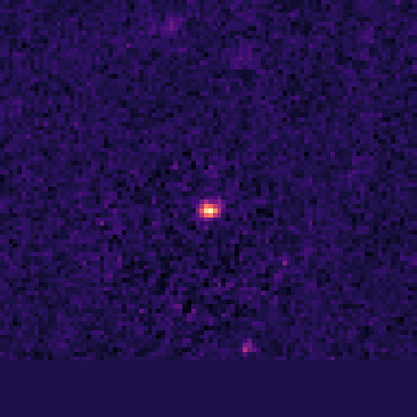

<div align="center">

</div>

---
configs:
- config_name: default
  data_dir: mmu_jwst_primer_uds/dataset
tags:
- astronomy
license: cc-by-4.0
pretty_name: mmu_jwst_primer_uds
size_categories:
- 10K<n<100K
---

# mmu_jwst_primer_uds HATS Catalog Collection

This is the collection of HATS catalogs representing mmu_jwst_primer_uds.

This dataset is part of the [Multimodal Universe](https://github.com/MultimodalUniverse/MultimodalUniverse),
a large-scale collection of multimodal astronomical data. For full details, see the paper:
[The Multimodal Universe: Enabling Large-Scale Machine Learning with 100TBs of Astronomical Scientific Data](https://arxiv.org/abs/2412.02527).

### Access the catalog

We recommend the use of the [LSDB](https://lsdb.io) Python framework to access HATS catalogs.
LSDB can be installed via `pip install lsdb` or `conda install conda-forge::lsdb`,
see more details [in the docs](https://docs.lsdb.io/).
The following code provides a minimal example of opening this catalog:

```python
import lsdb

# Full sky coverage.
catalog = lsdb.open_catalog("https://huggingface.co/datasets/UniverseTBD/mmu_jwst_primer_uds")
# One-degree cone.
catalog = lsdb.open_catalog(
    "https://huggingface.co/datasets/UniverseTBD/mmu_jwst_primer_uds",
    search_filter=lsdb.ConeSearch(ra=34.0, dec=-5.0, radius_arcsec=3600.0),
)
```

Each catalog in this collection is represented as a separate [Apache Parquet dataset](https://arrow.apache.org/docs/python/dataset.html) and can be accessed with a variety of tools, including `pandas`, `pyarrow`, `dask`, `Spark`, `DuckDB`.

### File structure

This catalog is represented by the following files and directories:

- [`collection.properties`](https://huggingface.co/datasets/UniverseTBD/mmu_jwst_primer_uds/collection.properties) — textual metadata file describing the HATS collection of catalogs
- [`mmu_jwst_primer_uds`](https://huggingface.co/datasets/UniverseTBD/mmu_jwst_primer_uds/mmu_jwst_primer_uds) — main HATS catalog directory
  - [`dataset/`](https://huggingface.co/datasets/UniverseTBD/mmu_jwst_primer_uds/mmu_jwst_primer_uds/dataset/) — Apache Parquet dataset directory for the main catalog
    - ... parquet metadata and data files in sub directories ...
  - [`hats.properties`](https://huggingface.co/datasets/UniverseTBD/mmu_jwst_primer_uds/mmu_jwst_primer_uds/hats.properties) — textual metadata file describing the main HATS catalog
  - [`partition_info.csv`](https://huggingface.co/datasets/UniverseTBD/mmu_jwst_primer_uds/mmu_jwst_primer_uds/partition_info.csv) — CSV file with a list of catalog HEALPix tiles (catalog partitions)
  - [`skymap.fits`](https://huggingface.co/datasets/UniverseTBD/mmu_jwst_primer_uds/mmu_jwst_primer_uds/skymap.fits) — HEALPix skymap FITS file with row-counts per HEALPix tile of fixed order 10
- [`mmu_jwst_primer_uds_10arcs/`](https://huggingface.co/datasets/UniverseTBD/mmu_jwst_primer_uds/mmu_jwst_primer_uds_10arcs) — default margin catalog to ensure data completeness in cross-matching, the margin threshold is 10.0 arcseconds
  - ... margin catalog files and directories ...

### Catalog metadata

Metadata of the main HATS catalog, excluding margins and indexes:

| **Number of rows** | **Number of columns** | **Number of partitions** | **Size on disk** | **HATS Builder** |
| --- | --- | --- | --- | --- |
| 66,660 | 11 | 22 | 22.7 GiB | hats-import v0.7.3, hats v0.7.3 |


### Catalog columns

The main HATS catalog contains the following columns:

| **Name** |  **`_healpix_29`** | **`image.band`** | **`image.flux`** | **`image.ivar`** | **`image.mask`** | **`image.psf_fwhm`** | **`image.scale`** | **`mag_auto`** | **`flux_radius`** | **`flux_auto`** | **`fluxerr_auto`** | **`cxx_image`** | **`cyy_image`** | **`cxy_image`** | **`object_id`** | **`ra`** | **`dec`** |
| --- |  --- | --- | --- | --- | --- | --- | --- | --- | --- | --- | --- | --- | --- | --- | --- | --- | --- |
| **Data Type** |  int64 | list[string] | list[list<element: list<element: float>>] | list[list<element: list<element: float>>] | list[list<element: list<element: bool>>] | list[float] | list[float] | float | float | float | float | float | float | float | string | double | double |
| **Nested?** |  — | image | image | image | image | image | image | — | — | — | — | — | — | — | — | — | — |
| **Value count** |  66,660 | 466,620 | *N/A* | *N/A* | *N/A* | 466,620 | 466,620 | 66,660 | 66,660 | 66,660 | 66,660 | 66,660 | 66,660 | 66,660 | 66,660 | 66,660 | 66,660 |
| **Example row** |  1244081442258414734 | [f090w, f115w, f150w, f200w, f277w, … (7 total)] | [[[0.1339, 0.1695, 0.01594, -0.01652, … (96 total)], … (96 total)], …… | [[[104.3, 99.23, 130.4, 121.7, 108.9, … (96 total)], … (96 total)], …… | [[[True, True, True, True, True, True, … (96 total)], … (96 total)], … | [0.033, 0.04, 0.05, 0.066, 0.092, … (7 total)] | [0.04, 0.04, 0.04, 0.04, 0.04, 0.04, … (7 total)] | 24.76 | 4.374 | 0.3911 | 0.004391 | 0.04621 | 0.1452 | 0.009686 | 5481758738572589643 | 34.22 | -5.207 |
| **Minimum value** |  1244073128803644245 | f090w | *N/A* | *N/A* | *N/A* | 0.032999999821186066 | 0.03999999910593033 | 15.883356094360352 | 0.5410636067390442 | 0.04745132848620415 | 0.000631449802313 | 1.4279617062129546e-05 | 2.961887548735831e-05 | -1.0529983043670654 | -1502803815681653184 | 34.19782039975754 | -5.3373375913611865 |
| **Maximum value** |  1244836278796287736 | f444w | *N/A* | *N/A* | *N/A* | 0.14499999582767487 | 0.03999999910593033 | 26.999980926513672 | 775.8671875 | 1609.376708984375 | 237.3377227783203 | 3.3322954177856445 | 1.9879162311553955 | 2.0581705570220947 | 5481758738572675269 | 34.53875468066159 | -5.06434849884021 |


"Nested" indicates whether the column is stored as a nested field inside another "struct" column.


"Value count" may be different from the total number of rows for nested columns: each nested element is counted as a single value.


### Crossmatch with another catalog

HATS catalogs can be efficiently crossmatched using [LSDB](https://lsdb.io),
which leverages the HEALPix partitioning to avoid loading the full datasets into memory:

```python
import lsdb

mmu_jwst_primer_uds = lsdb.open_catalog("https://huggingface.co/datasets/UniverseTBD/mmu_jwst_primer_uds")
other = lsdb.open_catalog("https://huggingface.co/datasets/<org>/<other_catalog>")

crossmatched = mmu_jwst_primer_uds.crossmatch(other, radius_arcsec=1.0)
print(crossmatched)
```

See the [LSDB documentation](https://docs.lsdb.io/) for more details on crossmatching and other operations.

### Dataset-specific context

**Original survey**  
This dataset is based on the James Webb Space Telescope (JWST) NIRCam observations from early deep field surveys.

**Data modality**  
The dataset consists of fixed-size image cutouts (96×96 pixels) centered on sources from photometric catalogs. The images are multi-band, with 6 or 7 filters covering wavelengths from approximately 0.9μm to 4.4μm.

**Typical use cases**  
Images from these JWST deep field surveys have been used in a large number of scientific publications, including machine learning applications.

**Caveats**  
Different surveys have different wavelength coverage, and missing bands are represented as arrays of zeros to simplify data loading.

**Citation**  
The data are in the public domain. The dataset uses data products retrieved from the Dawn JWST Archive (DJA), an initiative of the Cosmic Dawn Center (DAWN).
