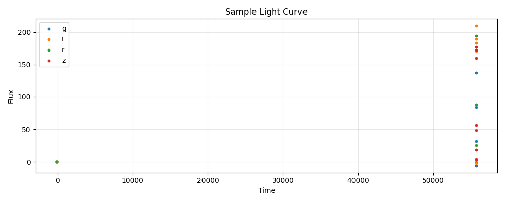

<div align="center">

</div>

---
configs:
- config_name: default
  data_dir: mmu_ps1_sne_ia/dataset
tags:
- astronomy
license: cc-by-4.0
pretty_name: mmu_ps1_sne_ia
size_categories:
- n<1K
---

# mmu_ps1_sne_ia HATS Catalog Collection

This is the collection of HATS catalogs representing mmu_ps1_sne_ia.

This dataset is part of the [Multimodal Universe](https://github.com/MultimodalUniverse/MultimodalUniverse),
a large-scale collection of multimodal astronomical data. For full details, see the paper:
[The Multimodal Universe: Enabling Large-Scale Machine Learning with 100TBs of Astronomical Scientific Data](https://arxiv.org/abs/2412.02527).

### Access the catalog

We recommend the use of the [LSDB](https://lsdb.io) Python framework to access HATS catalogs.
LSDB can be installed via `pip install lsdb` or `conda install conda-forge::lsdb`,
see more details [in the docs](https://docs.lsdb.io/).
The following code provides a minimal example of opening this catalog:

```python
import lsdb

# Full sky coverage.
catalog = lsdb.open_catalog("https://huggingface.co/datasets/UniverseTBD/mmu_ps1_sne_ia")
# One-degree cone.
catalog = lsdb.open_catalog(
    "https://huggingface.co/datasets/UniverseTBD/mmu_ps1_sne_ia",
    search_filter=lsdb.ConeSearch(ra=164.0, dec=58.0, radius_arcsec=3600.0),
)
```

Each catalog in this collection is represented as a separate [Apache Parquet dataset](https://arrow.apache.org/docs/python/dataset.html) and can be accessed with a variety of tools, including `pandas`, `pyarrow`, `dask`, `Spark`, `DuckDB`.

### File structure

This catalog is represented by the following files and directories:

- [`collection.properties`](https://huggingface.co/datasets/UniverseTBD/mmu_ps1_sne_ia/collection.properties) � textual metadata file describing the HATS collection of catalogs
- [`mmu_ps1_sne_ia`](https://huggingface.co/datasets/UniverseTBD/mmu_ps1_sne_ia/mmu_ps1_sne_ia) � main HATS catalog directory
  - [`dataset/`](https://huggingface.co/datasets/UniverseTBD/mmu_ps1_sne_ia/mmu_ps1_sne_ia/dataset/) � Apache Parquet dataset directory for the main catalog
    - ... parquet metadata and data files in sub directories ...
  - [`hats.properties`](https://huggingface.co/datasets/UniverseTBD/mmu_ps1_sne_ia/mmu_ps1_sne_ia/hats.properties) � textual metadata file describing the main HATS catalog
  - [`partition_info.csv`](https://huggingface.co/datasets/UniverseTBD/mmu_ps1_sne_ia/mmu_ps1_sne_ia/partition_info.csv) � CSV file with a list of catalog HEALPix tiles (catalog partitions)
  - [`skymap.fits`](https://huggingface.co/datasets/UniverseTBD/mmu_ps1_sne_ia/mmu_ps1_sne_ia/skymap.fits) � HEALPix skymap FITS file with row-counts per HEALPix tile of fixed order 10
- [`mmu_ps1_sne_ia_10arcs/`](https://huggingface.co/datasets/UniverseTBD/mmu_ps1_sne_ia/mmu_ps1_sne_ia_10arcs) � default margin catalog to ensure data completeness in cross-matching, the margin threshold is 10.0 arcseconds
  - ... margin catalog files and directories ...

### Catalog metadata

Metadata of the main HATS catalog, excluding margins and indexes:

| **Number of rows** | **Number of columns** | **Number of partitions** | **Size on disk** | **HATS Builder** |
| --- | --- | --- | --- | --- |
| 738 | 7 | 28 | 192.4 MiB | hats-import v0.7.3, hats v0.7.3 |


### Catalog columns

The main HATS catalog contains the following columns:

| **Name** |  **`_healpix_29`** | **`lightcurve.band`** | **`lightcurve.time`** | **`lightcurve.flux`** | **`lightcurve.flux_err`** | **`redshift`** | **`host_log_mass`** | **`ra`** | **`dec`** | **`obj_type`** | **`object_id`** |
| --- |  --- | --- | --- | --- | --- | --- | --- | --- | --- | --- | --- |
| **Data Type** |  int64 | list[string] | list[float] | list[float] | list[float] | float | float | double | double | string | string |
| **Nested?** |  � | lightcurve | lightcurve | lightcurve | lightcurve | � | � | � | � | � | � |
| **Value count** |  738 | 42,704 | 42,704 | 42,704 | 42,704 | 738 | 738 | 738 | 738 | 738 | 738 |
| **Example row** |  428595909949812426 | [g, g, g, g, g, g, g, g, g, g, g, g, � (60 total)] | [5.522e+04, 5.523e+04, 5.523e+04, � (60 total)] | [24.81, -74.01, -12.18, -94.85, � (60 total)] | [21.15, 32.62, 25.4, 22.79, 19.13, � (60 total)] | 0.08139 | 10.25 | 164.4 | 57.61 | Ia | PS1_10454 |
| **Minimum value** |  425588575368636354 | g | -99.0 | -1014.1060180664062 | -0.0 | 0.025965053588151932 | -99.0 | 34.418312072753906 | -29.01378631591797 | Ia | PS1_10 |
| **Maximum value** |  2542426302784921595 | z | 56709.3984375 | 22921.455078125 | 1739.5040283203125 | 0.6719424724578857 | 12.804227828979492 | 353.5986328125 | 59.01899337768555 | Ia | PS1_91869 |


"Nested" indicates whether the column is stored as a nested field inside another "struct" column.


"Value count" may be different from the total number of rows for nested columns: each nested element is counted as a single value.


### Crossmatch with another catalog

HATS catalogs can be efficiently crossmatched using [LSDB](https://lsdb.io),
which leverages the HEALPix partitioning to avoid loading the full datasets into memory:

```python
import lsdb

mmu_ps1_sne_ia = lsdb.open_catalog("https://huggingface.co/datasets/UniverseTBD/mmu_ps1_sne_ia")
other = lsdb.open_catalog("https://huggingface.co/datasets/<org>/<other_catalog>")

crossmatched = mmu_ps1_sne_ia.crossmatch(other, radius_arcsec=1.0)
print(crossmatched)
```

See the [LSDB documentation](https://docs.lsdb.io/) for more details on crossmatching and other operations.

### Dataset-specific context

**Original survey**  
This dataset is based on the Pan-STARRS1 (PS1) survey and contains a collection of 369 spectroscopically confirmed Type Ia supernova light curves from the PS1 SNe Ia sample.

**Data modality**  
The dataset consists of light curve data including time of observation, flux, flux error, and filter information (griz bands). Additional metadata includes coordinates, redshift, and host galaxy mass.

**Typical use cases**  
The dataset can be used for tasks such as photometric redshift prediction or light curve inpainting.

**Caveats**  
The data is collected from the Pantheon+ compilation, which applies a series of selection cuts.

**Citation**  
The dataset is released under the CC BY 4.0 license. Users should cite the Pan-STARRS1 survey and follow the acknowledgements provided on the official project webpage.
