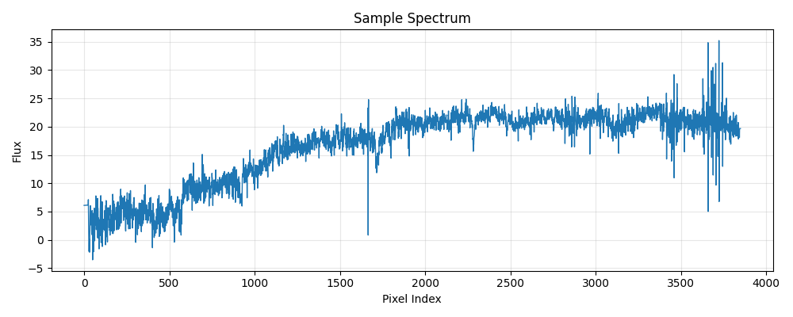

---
configs:
- config_name: default
  data_dir: mmu_sdss_sdss/dataset
tags:
- astronomy
license: cc-by-4.0
pretty_name: mmu_sdss_sdss
size_categories:
- 100K<n<1M
---

<div align="center">

</div>

# mmu_sdss_sdss HATS Catalog Collection

This is the collection of HATS catalogs representing mmu_sdss_sdss.

This dataset is part of the [Multimodal Universe](https://github.com/MultimodalUniverse/MultimodalUniverse),
a large-scale collection of multimodal astronomical data. For full details, see the paper:
[The Multimodal Universe: Enabling Large-Scale Machine Learning with 100TBs of Astronomical Scientific Data](https://arxiv.org/abs/2412.02527).

### Access the catalog

We recommend the use of the [LSDB](https://lsdb.io) Python framework to access HATS catalogs.
LSDB can be installed via `pip install lsdb` or `conda install conda-forge::lsdb`,
see more details [in the docs](https://docs.lsdb.io/).
The following code provides a minimal example of opening this catalog:

```python
import lsdb

# Full sky coverage.
catalog = lsdb.open_catalog("https://huggingface.co/datasets/LSDB/mmu_sdss_sdss")
# One-degree cone.
catalog = lsdb.open_catalog(
    "https://huggingface.co/datasets/LSDB/mmu_sdss_sdss",
    search_filter=lsdb.ConeSearch(ra=136.0, dec=24.0, radius_arcsec=3600.0),
)
```

Each catalog in this collection is represented as a separate [Apache Parquet dataset](https://arrow.apache.org/docs/python/dataset.html) and can be accessed with a variety of tools, including `pandas`, `pyarrow`, `dask`, `Spark`, `DuckDB`.

### File structure

This catalog is represented by the following files and directories:

- [`collection.properties`](https://huggingface.co/datasets/LSDB/mmu_sdss_sdss/collection.properties) — textual metadata file describing the HATS collection of catalogs
- [`mmu_sdss_sdss`](https://huggingface.co/datasets/LSDB/mmu_sdss_sdss/mmu_sdss_sdss) — main HATS catalog directory
  - [`dataset/`](https://huggingface.co/datasets/LSDB/mmu_sdss_sdss/mmu_sdss_sdss/dataset/) — Apache Parquet dataset directory for the main catalog
    - ... parquet metadata and data files in sub directories ...
  - [`hats.properties`](https://huggingface.co/datasets/LSDB/mmu_sdss_sdss/mmu_sdss_sdss/hats.properties) — textual metadata file describing the main HATS catalog
  - [`partition_info.csv`](https://huggingface.co/datasets/LSDB/mmu_sdss_sdss/mmu_sdss_sdss/partition_info.csv) — CSV file with a list of catalog HEALPix tiles (catalog partitions)
  - [`skymap.fits`](https://huggingface.co/datasets/LSDB/mmu_sdss_sdss/mmu_sdss_sdss/skymap.fits) — HEALPix skymap FITS file with row-counts per HEALPix tile of fixed order 10
- [`mmu_sdss_sdss_10arcs/`](https://huggingface.co/datasets/LSDB/mmu_sdss_sdss/mmu_sdss_sdss_10arcs) — default margin catalog to ensure data completeness in cross-matching, the margin threshold is 10.0 arcseconds
  - ... margin catalog files and directories ...

### Catalog metadata

Metadata of the main HATS catalog, excluding margins and indexes:

| **Number of rows** | **Number of columns** | **Number of partitions** | **Size on disk** | **HATS Builder** |
| --- | --- | --- | --- | --- |
| 806,176 | 30 | 789 | 31.8 GiB | hats-import v0.7.1, hats v0.7.1 |


### Catalog columns

The main HATS catalog contains the following columns:

| **Name** |  **`_healpix_29`** | **`spectrum.flux`** | **`spectrum.ivar`** | **`spectrum.lsf_sigma`** | **`spectrum.lambda`** | **`spectrum.mask`** | **`VDISP`** | **`VDISP_ERR`** | **`Z`** | **`Z_ERR`** | **`ra`** | **`dec`** | **`healpix`** | **`ZWARNING`** | **`SPECTROFLUX_U`** | **`SPECTROFLUX_G`** | **`SPECTROFLUX_R`** | **`SPECTROFLUX_I`** | **`SPECTROFLUX_Z`** | **`SPECTROFLUX_IVAR_U`** | **`SPECTROFLUX_IVAR_G`** | **`SPECTROFLUX_IVAR_R`** | **`SPECTROFLUX_IVAR_I`** | **`SPECTROFLUX_IVAR_Z`** | **`SPECTROSYNFLUX_U`** | **`SPECTROSYNFLUX_G`** | **`SPECTROSYNFLUX_R`** | **`SPECTROSYNFLUX_I`** | **`SPECTROSYNFLUX_Z`** | **`SPECTROSYNFLUX_IVAR_U`** | **`SPECTROSYNFLUX_IVAR_G`** | **`SPECTROSYNFLUX_IVAR_R`** | **`SPECTROSYNFLUX_IVAR_I`** | **`SPECTROSYNFLUX_IVAR_Z`** | **`object_id`** |
| --- |  --- | --- | --- | --- | --- | --- | --- | --- | --- | --- | --- | --- | --- | --- | --- | --- | --- | --- | --- | --- | --- | --- | --- | --- | --- | --- | --- | --- | --- | --- | --- | --- | --- | --- | --- |
| **Data Type** |  int64 | list[float] | list[float] | list[float] | list[float] | list[bool] | float | float | float | float | double | double | int64 | bool | float | float | float | float | float | float | float | float | float | float | float | float | float | float | float | float | float | float | float | float | string |
| **Nested?** |  — | spectrum | spectrum | spectrum | spectrum | spectrum | — | — | — | — | — | — | — | — | — | — | — | — | — | — | — | — | — | — | — | — | — | — | — | — | — | — | — | — | — |
| **Value count** |  806,176 | 3,113,669,518 | 3,113,669,518 | 3,113,669,518 | 3,113,669,518 | 3,113,669,518 | 806,176 | 806,176 | 806,176 | 806,176 | 806,176 | 806,176 | 806,176 | 806,176 | 806,176 | 806,176 | 806,176 | 806,176 | 806,176 | 806,176 | 806,176 | 806,176 | 806,176 | 806,176 | 806,176 | 806,176 | 806,176 | 806,176 | 806,176 | 806,176 | 806,176 | 806,176 | 806,176 | 806,176 | 806,176 |
| **Example row** |  343977106285581288 | [2.24, 2.24, 2.24, 2.239, 2.239, … (3864 total)] | [0, 0, 0, 0, 0, 0, 0, 0, 0, 0, 0, … (3864 total)] | [0, 0, 0, 0, 0, 0, 0, 0, 0, 0, 0, … (3864 total)] | [3805, 3806, 3807, 3808, 3809, … (3864 total)] | [True, True, True, True, True, … (3864 total)] | 182.7 | 11.25 | 0.1305 | 3.128e-05 | 136.5 | 23.81 | 305 | False | 4.558 | 17.05 | 48.13 | 73.82 | 100.3 | 1.352 | 4.696 | 2.782 | 1.695 | 0.6382 | 4.557 | 17.02 | 48.1 | 73.43 | 99.54 | 3.227 | 4.65 | 2.981 | 1.962 | 0.7785 | b'   2575025233207519232' |
| **Minimum value** |  168688995934 | -1399.4620361328125 | -0.0 | -0.0 | -1.0 | False | -0.0 | -4.0 | -0.011087613180279732 | -6.0 | 0.000686 | -11.25283 | 0 | False | -53.29541778564453 | -8.221423149108887 | -3.079059362411499 | -5.200530052185059 | -56.53141784667969 | 0.018610242754220963 | 0.021417152136564255 | 0.018582580611109734 | 0.01028701663017273 | 0.0032096304930746555 | -903.9955444335938 | -431.1527099609375 | -6.962734699249268 | -41.03329849243164 | -120.22126770019531 | 0.014560655690729618 | 0.020548932254314423 | 0.013832802884280682 | 0.009603755548596382 | 0.004050940275192261 | b'    299489677444933632' |
| **Maximum value** |  3458764448209686099 | 224369.609375 | 126889.46875 | 1.6645588874816895 | 9272.5673828125 | True | 850.0 | 2262.74169921875 | 7.003869533538818 | 867.6547241210938 | 359.99936 | 70.287347 | 3071 | True | 28427.263671875 | 129483.3828125 | 346752.21875 | 780947.1875 | 1373210.875 | 3.3445169925689697 | 10.681514739990234 | 6.103046417236328 | 3.457676649093628 | 2.023735523223877 | 26742.1796875 | 127758.609375 | 349161.75 | 727656.0 | 1344424.875 | 9.424415588378906 | 10.719206809997559 | 6.276713848114014 | 3.996629238128662 | 2.6291794776916504 | b'   3381253423394562048' |


"Nested" indicates whether the column is stored as a nested field inside another "struct" column.


"Value count" may be different from the total number of rows for nested columns: each nested element is counted as a single value.


### Crossmatch with another catalog

HATS catalogs can be efficiently crossmatched using [LSDB](https://lsdb.io),
which leverages the HEALPix partitioning to avoid loading the full datasets into memory:

```python
import lsdb

mmu_sdss_sdss = lsdb.open_catalog("https://huggingface.co/datasets/LSDB/mmu_sdss_sdss")
other = lsdb.open_catalog("https://huggingface.co/datasets/<org>/<other_catalog>")

crossmatched = mmu_sdss_sdss.crossmatch(other, radius_arcsec=1.0)
print(crossmatched)
```

See the [LSDB documentation](https://docs.lsdb.io/) for more details on crossmatching and other operations.

### Dataset-specific context

**Original survey**  
This dataset is based on the Sloan Digital Sky Survey (SDSS), which has mapped a large portion of the sky using a dedicated optical telescope. It includes data from multiple SDSS programs, including the Legacy survey, SEGUE-1, SEGUE-2, BOSS, and eBOSS surveys.

**Data modality**  
The dataset consists of optical spectra covering wavelength ranges from 3800 to 9200 (SDSS spectrograph) and 3650 to 10400 (BOSS spectrograph). Each spectrum includes flux measurements, wavelength values, and inverse variance (ivar), along with pixel-level masks indicating potential quality issues. The dataset contains approximately 4 million spectra.

**Typical use cases**  
SDSS spectra have been used in numerous scientific publications. Machine learning applications include building data-driven representations of galaxy spectra and identifying outliers.

**Caveats**  
The dataset includes spectra of varying lengths. It also applies selection cuts, including avoiding duplicate spectra for the same object, keeping only good-quality plates, and selecting only science targets.

**Citation**  
SDSS data releases are in the public domain. Users should include the appropriate acknowledgements for the SDSS, SEGUE-1, SEGUE-2, BOSS, and eBOSS samples when using this dataset.
