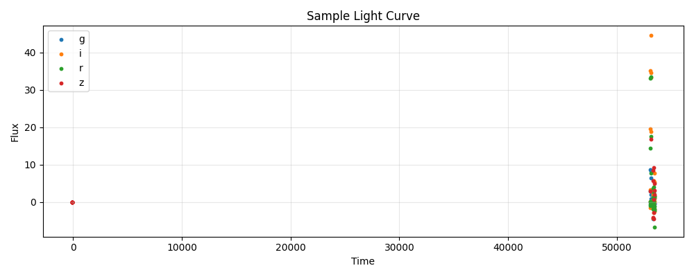

---
configs:
- config_name: default
  data_dir: mmu_snls/dataset
tags:
- astronomy
license: cc-by-4.0
pretty_name: mmu_snls
size_categories:
- n<1K
---

<div align="center">

</div>

# mmu_snls HATS Catalog Collection

This is the collection of HATS catalogs representing mmu_snls.

This dataset is part of the [Multimodal Universe](https://github.com/MultimodalUniverse/MultimodalUniverse),
a large-scale collection of multimodal astronomical data. For full details, see the paper:
[The Multimodal Universe: Enabling Large-Scale Machine Learning with 100TBs of Astronomical Scientific Data](https://arxiv.org/abs/2412.02527).

### Access the catalog

We recommend the use of the [LSDB](https://lsdb.io) Python framework to access HATS catalogs.
LSDB can be installed via `pip install lsdb` or `conda install conda-forge::lsdb`,
see more details [in the docs](https://docs.lsdb.io/).
The following code provides a minimal example of opening this catalog:

```python
import lsdb

# Full sky coverage.
catalog = lsdb.open_catalog("https://huggingface.co/datasets/UniverseTBD/mmu_snls")
# One-degree cone.
catalog = lsdb.open_catalog(
    "https://huggingface.co/datasets/UniverseTBD/mmu_snls",
    search_filter=lsdb.ConeSearch(ra=216.0, dec=52.0, radius_arcsec=3600.0),
)
```

Each catalog in this collection is represented as a separate [Apache Parquet dataset](https://arrow.apache.org/docs/python/dataset.html) and can be accessed with a variety of tools, including `pandas`, `pyarrow`, `dask`, `Spark`, `DuckDB`.

### File structure

This catalog is represented by the following files and directories:

- [`collection.properties`](https://huggingface.co/datasets/UniverseTBD/mmu_snls/collection.properties) � textual metadata file describing the HATS collection of catalogs
- [`mmu_snls`](https://huggingface.co/datasets/UniverseTBD/mmu_snls/mmu_snls) � main HATS catalog directory
  - [`dataset/`](https://huggingface.co/datasets/UniverseTBD/mmu_snls/mmu_snls/dataset/) � Apache Parquet dataset directory for the main catalog
    - ... parquet metadata and data files in sub directories ...
  - [`hats.properties`](https://huggingface.co/datasets/UniverseTBD/mmu_snls/mmu_snls/hats.properties) � textual metadata file describing the main HATS catalog
  - [`partition_info.csv`](https://huggingface.co/datasets/UniverseTBD/mmu_snls/mmu_snls/partition_info.csv) � CSV file with a list of catalog HEALPix tiles (catalog partitions)
  - [`skymap.fits`](https://huggingface.co/datasets/UniverseTBD/mmu_snls/mmu_snls/skymap.fits) � HEALPix skymap FITS file with row-counts per HEALPix tile of fixed order 10
- [`mmu_snls_10arcs/`](https://huggingface.co/datasets/UniverseTBD/mmu_snls/mmu_snls_10arcs) � default margin catalog to ensure data completeness in cross-matching, the margin threshold is 10.0 arcseconds
  - ... margin catalog files and directories ...

### Catalog metadata

Metadata of the main HATS catalog, excluding margins and indexes:

| **Number of rows** | **Number of columns** | **Number of partitions** | **Size on disk** | **HATS Builder** |
| --- | --- | --- | --- | --- |
| 478 | 7 | 7 | 192.2 MiB | hats-import v0.7.3, hats v0.7.3 |


### Catalog columns

The main HATS catalog contains the following columns:

| **Name** |  **`_healpix_29`** | **`lightcurve.band`** | **`lightcurve.time`** | **`lightcurve.flux`** | **`lightcurve.flux_err`** | **`redshift`** | **`host_log_mass`** | **`obj_type`** | **`object_id`** | **`ra`** | **`dec`** |
| --- |  --- | --- | --- | --- | --- | --- | --- | --- | --- | --- | --- |
| **Data Type** |  int64 | list[string] | list[float] | list[float] | list[float] | float | float | string | string | double | double |
| **Nested?** |  � | lightcurve | lightcurve | lightcurve | lightcurve | � | � | � | � | � | � |
| **Value count** |  478 | 55,072 | 55,072 | 55,072 | 55,072 | 478 | 478 | 478 | 478 | 478 | 478 |
| **Example row** |  802467230274757920 | [g, g, g, g, g, g, g, g, g, g, g, g, � (88 total)] | [5.314e+04, 5.315e+04, 5.315e+04, � (88 total)] | [-0.374, -0.003, -0.119, 116.4, � (88 total)] | [1.003, 0.863, 0.727, 0.963, 1.153, � (88 total)] | 0.3405 | 9.356 | Ia | 04D3nh | 215.6 | 52.33 |
| **Minimum value** |  802465652001458125 | g | -99.0 | -48.99100112915039 | -0.0 | 0.12580470740795135 | 5.294000148773193 | Ia | 03D1au | 36.02301025390625 | -18.232067108154297 |
| **Maximum value** |  3412972210937248373 | z | 54095.55859375 | 1387.178955078125 | 54.29999923706055 | 1.0607936382293701 | 11.579999923706055 | Ia | 06D4dh | 334.3792724609375 | 53.18427658081055 |


"Nested" indicates whether the column is stored as a nested field inside another "struct" column.


"Value count" may be different from the total number of rows for nested columns: each nested element is counted as a single value.


### Crossmatch with another catalog

HATS catalogs can be efficiently crossmatched using [LSDB](https://lsdb.io),
which leverages the HEALPix partitioning to avoid loading the full datasets into memory:

```python
import lsdb

mmu_snls = lsdb.open_catalog("https://huggingface.co/datasets/UniverseTBD/mmu_snls")
other = lsdb.open_catalog("https://huggingface.co/datasets/<org>/<other_catalog>")

crossmatched = mmu_snls.crossmatch(other, radius_arcsec=1.0)
print(crossmatched)
```

See the [LSDB documentation](https://docs.lsdb.io/) for more details on crossmatching and other operations.

### Dataset-specific context

**Original survey**  
This dataset is based on the Supernova Legacy Survey (SNLS) and contains a collection of 239 spectroscopically confirmed Type Ia supernova light curves.

**Data modality**  
The dataset consists of light curve data including time of observation, flux, flux error, and band pass filter information (griz bands). Additional metadata includes supernova classification, coordinates, redshift, and host galaxy mass.

**Typical use cases**  
The dataset can be used for photometric redshift prediction and light curve inpainting.

**Caveats**  
The data is collected from the Pantheon+ compilation, which applies a series of selection cuts.

**Citation**  
The dataset is released under the GNU General Public License v3.0. Users should attribute the original SNLS [data source](https://arxiv.org/pdf/1010.4743) appropriately.
