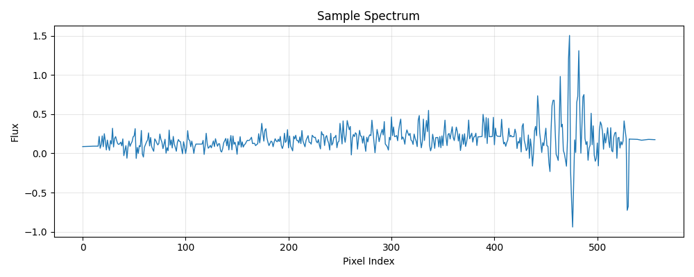

<div align="center">

</div>

---
configs:
- config_name: default
  data_dir: mmu_vipers_w4/dataset
tags:
- astronomy
license: cc-by-4.0
pretty_name: mmu_vipers_w4
size_categories:
- 10K<n<100K
---

# mmu_vipers_w4 HATS Catalog Collection

This is the collection of HATS catalogs representing mmu_vipers_w4.

This dataset is part of the [Multimodal Universe](https://github.com/MultimodalUniverse/MultimodalUniverse),
a large-scale collection of multimodal astronomical data. For full details, see the paper:
[The Multimodal Universe: Enabling Large-Scale Machine Learning with 100TBs of Astronomical Scientific Data](https://arxiv.org/abs/2412.02527).

### Access the catalog

We recommend the use of the [LSDB](https://lsdb.io) Python framework to access HATS catalogs.
LSDB can be installed via `pip install lsdb` or `conda install conda-forge::lsdb`,
see more details [in the docs](https://docs.lsdb.io/).
The following code provides a minimal example of opening this catalog:

```python
import lsdb

# Full sky coverage.
catalog = lsdb.open_catalog("https://huggingface.co/datasets/LSDB/mmu_vipers_w4")
# One-degree cone.
catalog = lsdb.open_catalog(
    "https://huggingface.co/datasets/LSDB/mmu_vipers_w4",
    search_filter=lsdb.ConeSearch(ra=333.0, dec=1.0, radius_arcsec=3600.0),
)
```

Each catalog in this collection is represented as a separate [Apache Parquet dataset](https://arrow.apache.org/docs/python/dataset.html) and can be accessed with a variety of tools, including `pandas`, `pyarrow`, `dask`, `Spark`, `DuckDB`.

### File structure

This catalog is represented by the following files and directories:

- [`collection.properties`](https://huggingface.co/datasets/LSDB/mmu_vipers_w4/collection.properties) � textual metadata file describing the HATS collection of catalogs
- [`mmu_vipers_w4`](https://huggingface.co/datasets/LSDB/mmu_vipers_w4/mmu_vipers_w4) � main HATS catalog directory
  - [`dataset/`](https://huggingface.co/datasets/LSDB/mmu_vipers_w4/mmu_vipers_w4/dataset/) � Apache Parquet dataset directory for the main catalog
    - ... parquet metadata and data files in sub directories ...
  - [`hats.properties`](https://huggingface.co/datasets/LSDB/mmu_vipers_w4/mmu_vipers_w4/hats.properties) � textual metadata file describing the main HATS catalog
  - [`partition_info.csv`](https://huggingface.co/datasets/LSDB/mmu_vipers_w4/mmu_vipers_w4/partition_info.csv) � CSV file with a list of catalog HEALPix tiles (catalog partitions)
  - [`skymap.fits`](https://huggingface.co/datasets/LSDB/mmu_vipers_w4/mmu_vipers_w4/skymap.fits) � HEALPix skymap FITS file with row-counts per HEALPix tile of fixed order 10
- [`mmu_vipers_w4_10arcs/`](https://huggingface.co/datasets/LSDB/mmu_vipers_w4/mmu_vipers_w4_10arcs) � default margin catalog to ensure data completeness in cross-matching, the margin threshold is 10.0 arcseconds
  - ... margin catalog files and directories ...

### Catalog metadata

Metadata of the main HATS catalog, excluding margins and indexes:

| **Number of rows** | **Number of columns** | **Number of partitions** | **Size on disk** | **HATS Builder** |
| --- | --- | --- | --- | --- |
| 30,979 | 9 | 9 | 321.4 MiB | hats-import v0.7.1, hats v0.7.1 |


### Catalog columns

The main HATS catalog contains the following columns:

| **Name** |  **`_healpix_29`** | **`spectrum.flux`** | **`spectrum.ivar`** | **`spectrum.lambda`** | **`spectrum.mask`** | **`REDSHIFT`** | **`REDFLAG`** | **`EXPTIME`** | **`NORM`** | **`MAG`** | **`ra`** | **`dec`** | **`object_id`** |
| --- |  --- | --- | --- | --- | --- | --- | --- | --- | --- | --- | --- | --- | --- |
| **Data Type** |  int64 | list[float] | list[float] | list[float] | list[float] | float | float | float | float | float | float | float | string |
| **Nested?** |  � | spectrum | spectrum | spectrum | spectrum | � | � | � | � | � | � | � | � |
| **Value count** |  30,979 | 17,255,303 | 17,255,303 | 17,255,303 | 17,255,303 | 30,979 | 30,979 | 30,979 | 30,979 | 30,979 | 30,979 | 30,979 | 30,979 |
| **Example row** |  1339537029392400028 | [0.1504, 0.1525, 0.1538, 0.1543, � (557 total)] | [8.585e-17, 1.011e-16, 1.137e-16, � (557 total)] | [5514, 5521, 5529, 5536, 5543, � (557 total)] | [2, 2, 2, 2, 2, 2, 2, 2, 2, 2, 2, � (557 total)] | 0.7298 | 0.7298 | 540 | 2.768 | 21.98 | 333.4 | 1.077 | 404055346.0 |
| **Minimum value** |  1339504075142965993 | -1759.751953125 | -2.9612807435456968e-18 | 5514.27978515625 | -0.0 | -0.0 | -0.0 | 540.0 | 0.021366773173213005 | 15.182700157165527 | 330.0451965332031 | 0.8620766997337341 | 401007640.0 |
| **Maximum value** |  1341678248016204204 | 2786.57177734375 | 7.853208785491006e-07 | 9484.1201171875 | 3.0 | 4.395299911499023 | 4.395299911499023 | 540.0 | 3519.447509765625 | 23.96969985961914 | 335.39093017578125 | 2.3695244789123535 | 411162926.0 |


"Nested" indicates whether the column is stored as a nested field inside another "struct" column.


"Value count" may be different from the total number of rows for nested columns: each nested element is counted as a single value.


### Crossmatch with another catalog

HATS catalogs can be efficiently crossmatched using [LSDB](https://lsdb.io),
which leverages the HEALPix partitioning to avoid loading the full datasets into memory:

```python
import lsdb

mmu_vipers_w4 = lsdb.open_catalog("https://huggingface.co/datasets/LSDB/mmu_vipers_w4")
other = lsdb.open_catalog("https://huggingface.co/datasets/<org>/<other_catalog>")

crossmatched = mmu_vipers_w4.crossmatch(other, radius_arcsec=1.0)
print(crossmatched)
```

See the [LSDB documentation](https://docs.lsdb.io/) for more details on crossmatching and other operations.

### Dataset-specific context

**Original survey**  
This dataset is based on the VIMOS Public Extragalactic Redshift Survey (VIPERS), which provides optical spectra of galaxies in the redshift range 0.5 < z < 1.0.

**Data modality**  
The dataset consists of fixed-size optical spectra (1 × 557) covering a wavelength range from 5514 Å to 9484 Å. Each spectrum includes flux values, the corresponding wavelength vector, inverse variance (ivar), and a mask indicating the quality of each measurement. The dataset contains approximately 90,000 galaxy spectra.

**Typical use cases**  
This dataset has been used in a number of scientific publications, as well as in
machine learning specific applications, including source identification with SVMs and
galaxy classification with unsupervised methods.

**Caveats**  
The dataset includes spectra that have been normalized and transformed during preprocessing to ensure consistency with other datasets.

**Citation**  
This dataset uses data from the VIMOS Public Extragalactic Redshift Survey (VIPERS), obtained with the ESO Very Large Telescope. Users should acknowledge the [VIPERS survey](http://vipers.inaf.it) and its participating institutions.
